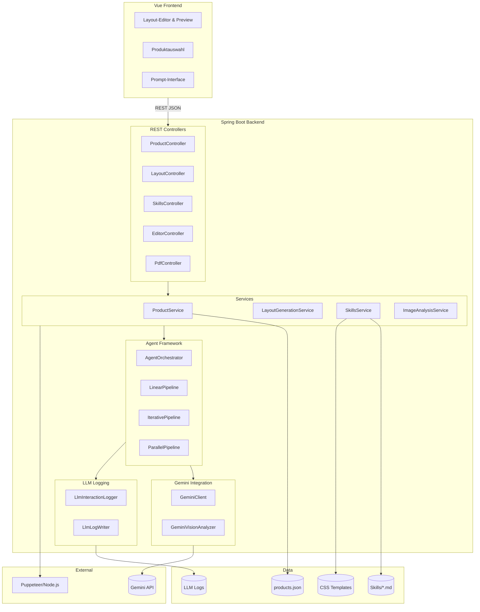
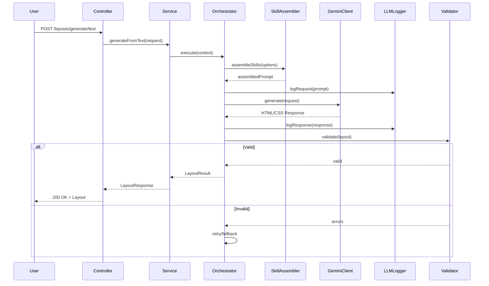
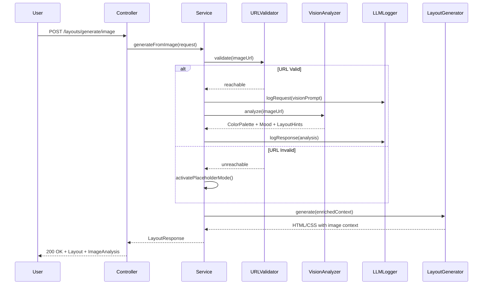
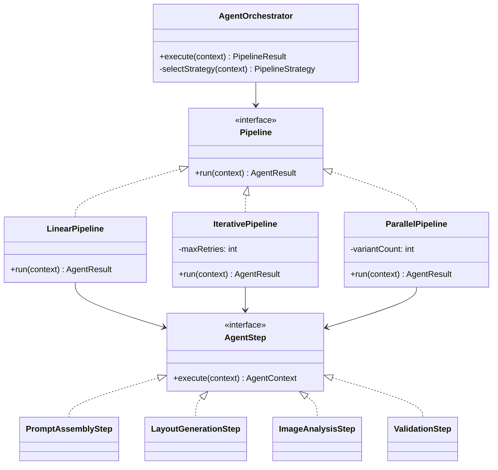
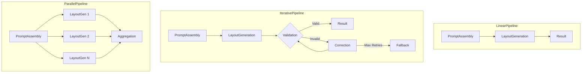
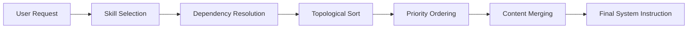
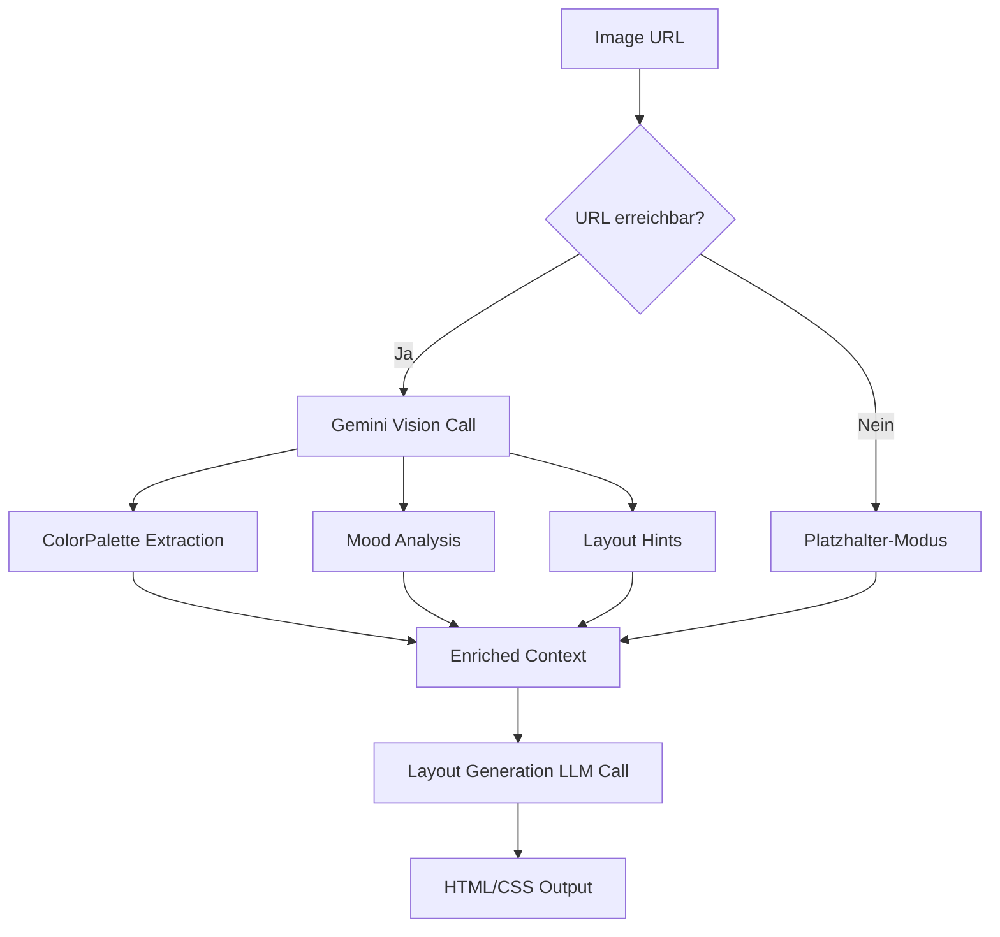
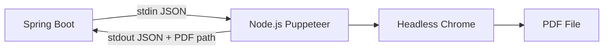
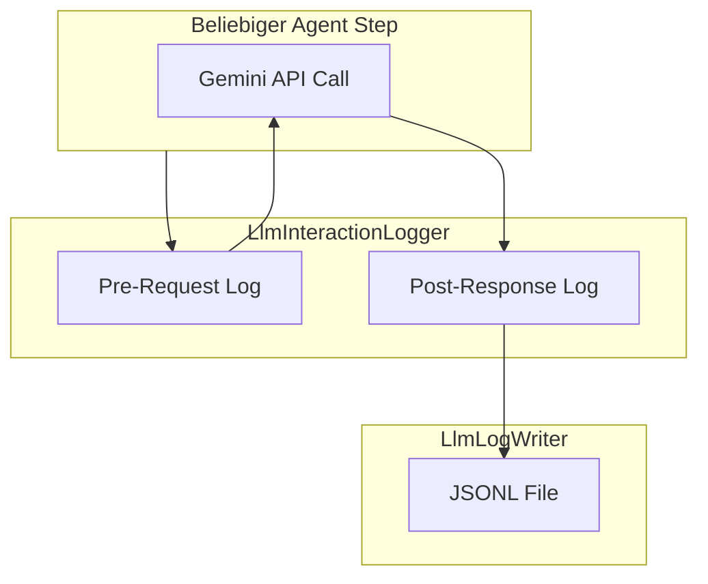

# CatalogForge – Vollständige Implementierungsspezifikation v1.0

## Generative AI-Powered Catalog & Flyer Creation Platform

---

## Inhaltsverzeichnis

1. [Executive Summary](#1-executive-summary)
2. [Bewusste Architekturentscheidungen](#2-bewusste-architekturentscheidungen)
3. [Systemarchitektur](#3-systemarchitektur)
4. [Technologie-Stack](#4-technologie-stack)
5. [Projektstruktur](#5-projektstruktur)
6. [Komponenten-Spezifikation](#6-komponenten-spezifikation)
7. [REST API Spezifikation](#7-rest-api-spezifikation)
8. [Agent-Orchestrierung Framework](#8-agent-orchestrierung-framework)
9. [Skills-System](#9-skills-system)
10. [LLM-basierte Bildverarbeitung](#10-llm-basierte-bildverarbeitung)
11. [PDF-Generierung](#11-pdf-generierung)
12. [LLM-Logging-System](#12-llm-logging-system)
13. [Konfiguration](#13-konfiguration)
14. [Test-Strategie](#14-test-strategie)
15. [Testfall-Katalog](#15-testfall-katalog)
16. [Bewusste Test-Ausschlüsse](#16-bewusste-test-ausschlüsse)
17. [Anhang: Prompt-Strukturen & Fixtures](#17-anhang-prompt-strukturen--fixtures)

---

## 1. Executive Summary

### 1.1 Projektvision

**CatalogForge** transformiert die Erstellung professioneller Produktkataloge und Flyer durch den Einsatz generativer KI. Die Plattform löst ein fundamentales Problem: Traditionelle LLM-Outputs sind nicht-deterministisch und für Printproduktion ungeeignet.

**Die Lösung:** Ein ausgeklügeltes **Skills-System**, das dem LLM präzise Constraints, CSS-Vorlagen und Layout-Regeln mitgibt, sodass die generierten HTML/CSS-Outputs direkt in druckfertige PDFs konvertiert werden können.

### 1.2 Kernfunktionalität

```
┌─────────────────────────────────────────────────────────────────┐
│                        CatalogForge                              │
├─────────────────────────────────────────────────────────────────┤
│                                                                  │
│   INPUT                      PROCESSING              OUTPUT      │
│   ─────                      ──────────              ──────      │
│   • Text-Prompt         →   • Skill-Assembly    →   • HTML/CSS   │
│   • Referenz-Bild (URL) →   • LLM-Generierung   →   • PDF        │
│   • Produktdaten        →   • Validation        →   • Varianten  │
│                                                                  │
└─────────────────────────────────────────────────────────────────┘
```

### 1.3 Scope dieser Spezifikation

| Aspekt | Beschreibung |
|--------|--------------|
| **Applikationstyp** | Spring Boot 3.4 REST API mit LLM-Integration (Gemini) |
| **Kernfunktion** | Text/Image → HTML/CSS Layout → PDF Kataloge |
| **Architektur** | Stateless REST, Custom Agent-Orchestrierung, Skills-basiertes Prompt Engineering |
| **Datenhaltung** | JSON-Files (products.json), Markdown-Skills, kein RDBMS |

---

## 2. Bewusste Architekturentscheidungen

> Diese Entscheidungen sind **deliberate trade-offs** – keine Kompromisse aus Zeitmangel.

### 2.1 Architektur-Prinzipien

| Prinzip | Entscheidung | Begründung |
|---------|--------------|------------|
| **Determinismus durch Constraints** | Skills-System mit CSS-Templates | LLM erhält so viele strukturierte Vorgaben, dass der Output-Raum auf valide Layouts eingeschränkt wird |
| **HTML/CSS als Layout-Sprache** | Web-Technologien statt proprietärer Formate | Maximale Flexibilität, Browser-basiertes Rendering, keine Lizenzkosten |
| **LLM-First Bildverarbeitung** | Gemini Vision statt OpenCV/PIL | Semantisches Verständnis, kontextbewusste Farbinterpretation, keine ML-Dependencies |
| **Pragmatische Datenhaltung** | JSON-Dateien statt Datenbank | MVP-Fokus, einfaches Deployment, keine DB-Migration erforderlich |
| **URL-basiertes Bildhandling** | Keine serverseitige Bildspeicherung | Reduzierte Komplexität, Client-seitiges Caching, GDPR-freundlich |
| **Eigenes Agent-Framework** | Keine LangChain/LlamaIndex | Volle Kontrolle, geringere Abhängigkeiten, maßgeschneidert für Use Case |

### 2.2 Bewusste Einschränkungen

| Einschränkung | Begründung |
|---------------|------------|
| **Keine Bild-Uploads** | Bilder werden via URL referenziert – reduziert Storage-Komplexität |
| **Kein User-Management** | MVP-Scope – später hinzufügbar |
| **Synchrone API-Calls** | Einfachheit vor Performance – Async später optimierbar |
| **Keine PDF-Caching** | Jeder Request generiert neu – Konsistenz vor Performance |

### 2.3 LLM-Logging: Kritische Designentscheidung

Alle LLM-Interaktionen werden chronologisch in dedizierten Log-Dateien persistiert:

- **Debugging**: Vollständige Rekonstruktion jeder Generierung
- **Optimierung**: Prompt-Engineering basierend auf realen Daten
- **Audit**: Nachvollziehbarkeit aller KI-Entscheidungen
- **Kosten-Tracking**: Token-Usage pro Request messbar

---

## 3. Systemarchitektur

### 3.1 High-Level Architektur



### 3.2 Datenfluss: Text-to-Layout



### 3.3 Datenfluss: Image-to-Layout (LLM-basiert)



---

## 4. Technologie-Stack

| Komponente | Technologie | Version | Begründung |
|------------|-------------|---------|------------|
| **Runtime** | Java | 21 (LTS) | Virtual Threads, Pattern Matching, Records |
| **Framework** | Spring Boot | 3.4.x | Neueste LTS, AOT-Support, Native Images |
| **Build Tool** | Gradle | 8.x | Kotlin DSL, schnellere Builds |
| **HTTP Client** | Spring WebClient | - | Reaktiv, non-blocking für LLM-Calls |
| **JSON Processing** | Jackson | - | Standard, performant |
| **PDF Generation** | Puppeteer (Node.js) | 23.x | Headless Chrome, pixelgenaues Rendering |
| **LLM API** | Google Gemini | 2.5 Flash/Pro | Multimodal, kosteneffizient |
| **Logging** | SLF4J + Logback | - | Standard + Custom LLM-Logger |

### Test-Stack

| Komponente | Verwendung |
|------------|------------|
| **JUnit 5** | Test-Lifecycle, Assertions |
| **Mockito** | Mocking, Stubbing, Verification |
| **Spring Boot Test** | @WebMvcTest, @SpringBootTest |
| **AssertJ** | Fluent Assertions |
| **JSONAssert** | JSON-Vergleiche |

---

## 5. Projektstruktur

### 5.1 Verzeichnisbaum

```
catalog-forge-backend/
│
├── build.gradle.kts
├── settings.gradle.kts
├── gradle.properties
│
├── logs/                                     # Runtime-generiert (gitignored)
│   ├── application/
│   │   └── catalogforge.log
│   └── llm/
│       ├── 2025-01-15_llm.jsonl              # Tägliche LLM-Logs (JSONL)
│       └── 2025-01-16_llm.jsonl
│
├── src/
│   ├── main/
│   │   ├── java/com/catalogforge/
│   │   │   │
│   │   │   ├── CatalogForgeApplication.java
│   │   │   │
│   │   │   ├── config/
│   │   │   │   ├── GeminiConfig.java
│   │   │   │   ├── WebConfig.java
│   │   │   │   ├── PuppeteerConfig.java
│   │   │   │   ├── SkillsConfig.java
│   │   │   │   └── LoggingConfig.java
│   │   │   │
│   │   │   ├── controller/
│   │   │   │   ├── ProductController.java
│   │   │   │   ├── LayoutController.java
│   │   │   │   ├── PdfController.java
│   │   │   │   ├── SkillsController.java
│   │   │   │   └── EditorController.java
│   │   │   │
│   │   │   ├── service/
│   │   │   │   ├── ProductService.java
│   │   │   │   ├── LayoutGenerationService.java
│   │   │   │   ├── PdfGenerationService.java
│   │   │   │   ├── ImageAnalysisService.java
│   │   │   │   ├── SkillsService.java
│   │   │   │   ├── LayoutEditorService.java
│   │   │   │   └── UrlValidationService.java
│   │   │   │
│   │   │   ├── agent/
│   │   │   │   ├── AgentOrchestrator.java
│   │   │   │   ├── AgentContext.java
│   │   │   │   ├── AgentResult.java
│   │   │   │   │
│   │   │   │   ├── pipeline/
│   │   │   │   │   ├── Pipeline.java
│   │   │   │   │   ├── LinearPipeline.java
│   │   │   │   │   ├── IterativePipeline.java
│   │   │   │   │   └── ParallelPipeline.java
│   │   │   │   │
│   │   │   │   ├── step/
│   │   │   │   │   ├── AgentStep.java
│   │   │   │   │   ├── PromptAssemblyStep.java
│   │   │   │   │   ├── ImageAnalysisStep.java
│   │   │   │   │   ├── LayoutGenerationStep.java
│   │   │   │   │   ├── ValidationStep.java
│   │   │   │   │   ├── CorrectionStep.java
│   │   │   │   │   └── FallbackStep.java
│   │   │   │   │
│   │   │   │   └── strategy/
│   │   │   │       ├── PipelineStrategy.java
│   │   │   │       ├── SimpleLayoutStrategy.java
│   │   │   │       ├── ComplexLayoutStrategy.java
│   │   │   │       └── MultiVariantStrategy.java
│   │   │   │
│   │   │   ├── gemini/
│   │   │   │   ├── GeminiClient.java
│   │   │   │   ├── GeminiRequest.java
│   │   │   │   ├── GeminiResponse.java
│   │   │   │   ├── GeminiModelSelector.java
│   │   │   │   ├── GeminiPromptBuilder.java
│   │   │   │   └── GeminiVisionAnalyzer.java
│   │   │   │
│   │   │   ├── logging/
│   │   │   │   ├── LlmInteractionLogger.java
│   │   │   │   ├── LlmLogEntry.java
│   │   │   │   ├── LlmLogWriter.java
│   │   │   │   ├── AgentActionLogger.java
│   │   │   │   └── LogRotationService.java
│   │   │   │
│   │   │   ├── skill/
│   │   │   │   ├── Skill.java
│   │   │   │   ├── SkillLoader.java
│   │   │   │   ├── SkillAssembler.java
│   │   │   │   ├── SkillResolver.java
│   │   │   │   └── SkillRegistry.java
│   │   │   │
│   │   │   ├── pdf/
│   │   │   │   ├── PuppeteerBridge.java
│   │   │   │   ├── PdfOptions.java
│   │   │   │   ├── PrintPreset.java
│   │   │   │   └── PdfResult.java
│   │   │   │
│   │   │   ├── image/
│   │   │   │   ├── ImageUrlValidator.java
│   │   │   │   ├── PlaceholderGenerator.java
│   │   │   │   ├── ImageAnalysisResult.java
│   │   │   │   └── ImageAnalysisPrompts.java
│   │   │   │
│   │   │   ├── layout/
│   │   │   │   ├── Layout.java
│   │   │   │   ├── LayoutElement.java
│   │   │   │   ├── LayoutPage.java
│   │   │   │   ├── LayoutValidator.java
│   │   │   │   ├── LayoutNormalizer.java
│   │   │   │   └── LayoutSerializer.java
│   │   │   │
│   │   │   ├── model/
│   │   │   │   ├── Product.java
│   │   │   │   ├── TechnicalData.java
│   │   │   │   ├── Catalog.java
│   │   │   │   ├── Category.java
│   │   │   │   ├── ColorPalette.java
│   │   │   │   ├── MoodAnalysis.java
│   │   │   │   ├── LayoutHints.java
│   │   │   │   │
│   │   │   │   ├── request/
│   │   │   │   │   ├── TextToLayoutRequest.java
│   │   │   │   │   ├── ImageToLayoutRequest.java
│   │   │   │   │   ├── PdfGenerationRequest.java
│   │   │   │   │   └── LayoutUpdateRequest.java
│   │   │   │   │
│   │   │   │   └── response/
│   │   │   │       ├── LayoutResponse.java
│   │   │   │       ├── PdfResponse.java
│   │   │   │       ├── ProductListResponse.java
│   │   │   │       ├── ImageAnalysisResponse.java
│   │   │   │       └── ErrorResponse.java
│   │   │   │
│   │   │   ├── exception/
│   │   │   │   ├── CatalogForgeException.java
│   │   │   │   ├── LayoutGenerationException.java
│   │   │   │   ├── PdfGenerationException.java
│   │   │   │   ├── SkillLoadException.java
│   │   │   │   ├── ImageAnalysisException.java
│   │   │   │   ├── ImageUrlNotReachableException.java
│   │   │   │   └── GlobalExceptionHandler.java
│   │   │   │
│   │   │   └── util/
│   │   │       ├── CssValidator.java
│   │   │       ├── HtmlSanitizer.java
│   │   │       ├── JsonUtils.java
│   │   │       ├── FileUtils.java
│   │   │       └── ColorUtils.java
│   │   │
│   │   └── resources/
│   │       ├── application.yml
│   │       ├── application-dev.yml
│   │       ├── application-prod.yml
│   │       ├── logback-spring.xml
│   │       │
│   │       ├── data/
│   │       │   └── products.json
│   │       │
│   │       ├── skills/
│   │       │   ├── MASTER_SKILL.md
│   │       │   ├── core/
│   │       │   │   ├── LAYOUT_PRINCIPLES.md
│   │       │   │   ├── TYPOGRAPHY.md
│   │       │   │   ├── COLOR_THEORY.md
│   │       │   │   ├── GRID_SYSTEMS.md
│   │       │   │   └── SPACING.md
│   │       │   ├── marketing/
│   │       │   │   ├── CATALOG_DESIGN.md
│   │       │   │   ├── AUTOMOTIVE_B2B.md
│   │       │   │   ├── VISUAL_HIERARCHY.md
│   │       │   │   ├── COPYWRITING.md
│   │       │   │   └── CTA_DESIGN.md
│   │       │   ├── page-types/
│   │       │   │   ├── PRODUCT_PAGE.md
│   │       │   │   ├── OVERVIEW_PAGE.md
│   │       │   │   ├── COVER_PAGE.md
│   │       │   │   ├── CATEGORY_PAGE.md
│   │       │   │   ├── COMPARISON_PAGE.md
│   │       │   │   ├── SPECS_PAGE.md
│   │       │   │   └── FLYER_PAGE.md
│   │       │   ├── styles/
│   │       │   │   ├── STYLE_MODERN.md
│   │       │   │   ├── STYLE_TECHNICAL.md
│   │       │   │   ├── STYLE_PREMIUM.md
│   │       │   │   ├── STYLE_DYNAMIC.md
│   │       │   │   └── STYLE_ECO.md
│   │       │   ├── formats/
│   │       │   │   ├── FORMAT_A4.md
│   │       │   │   ├── FORMAT_A5.md
│   │       │   │   ├── FORMAT_DL.md
│   │       │   │   ├── FORMAT_A6.md
│   │       │   │   └── FORMAT_SQUARE.md
│   │       │   └── image-analysis/
│   │       │       ├── COLOR_EXTRACTION.md
│   │       │       ├── MOOD_ANALYSIS.md
│   │       │       ├── LAYOUT_INSPIRATION.md
│   │       │       └── PLACEHOLDER_RULES.md
│   │       │
│   │       ├── css/
│   │       │   ├── base/
│   │       │   │   ├── reset.css
│   │       │   │   ├── variables.css
│   │       │   │   ├── typography.css
│   │       │   │   └── utilities.css
│   │       │   ├── components/
│   │       │   │   ├── product-card.css
│   │       │   │   ├── spec-table.css
│   │       │   │   ├── feature-list.css
│   │       │   │   ├── hero-image.css
│   │       │   │   ├── price-badge.css
│   │       │   │   ├── cta-button.css
│   │       │   │   ├── logo-header.css
│   │       │   │   └── image-placeholder.css
│   │       │   ├── layouts/
│   │       │   │   ├── grid-12col.css
│   │       │   │   ├── grid-modular.css
│   │       │   │   ├── layout-product-hero.css
│   │       │   │   ├── layout-product-split.css
│   │       │   │   ├── layout-product-specs.css
│   │       │   │   ├── layout-overview-grid.css
│   │       │   │   └── layout-comparison.css
│   │       │   └── print/
│   │       │       ├── print-base.css
│   │       │       ├── print-bleed.css
│   │       │       ├── print-cmyk-hints.css
│   │       │       └── print-crop-marks.css
│   │       │
│   │       ├── templates/
│   │       │   ├── product-page-hero.html
│   │       │   ├── product-page-split.html
│   │       │   ├── product-page-technical.html
│   │       │   ├── overview-grid-4col.html
│   │       │   ├── cover-simple.html
│   │       │   ├── flyer-dl-promo.html
│   │       │   ├── comparison-2products.html
│   │       │   └── placeholder-image.html
│   │       │
│   │       ├── prompts/
│   │       │   ├── example-prompts.json
│   │       │   ├── system-instruction.md
│   │       │   ├── output-format.md
│   │       │   └── vision/
│   │       │       ├── color-extraction-prompt.md
│   │       │       ├── mood-analysis-prompt.md
│   │       │       └── layout-analysis-prompt.md
│   │       │
│   │       └── static/
│   │           ├── fonts/
│   │           └── images/
│   │               └── placeholder.svg
│   │
│   └── test/
│       ├── java/com/catalogforge/
│       │   ├── controller/
│       │   │   ├── ProductControllerTest.java
│       │   │   ├── LayoutControllerTest.java
│       │   │   ├── SkillsControllerTest.java
│       │   │   └── EditorControllerTest.java
│       │   ├── service/
│       │   │   ├── ProductServiceTest.java
│       │   │   ├── LayoutServiceTest.java
│       │   │   ├── SkillServiceTest.java
│       │   │   └── EditorServiceTest.java
│       │   ├── agent/
│       │   │   ├── AgentOrchestratorTest.java
│       │   │   ├── AgentContextTest.java
│       │   │   ├── pipeline/
│       │   │   │   ├── LinearPipelineTest.java
│       │   │   │   ├── IterativePipelineTest.java
│       │   │   │   └── ParallelPipelineTest.java
│       │   │   └── step/
│       │   │       ├── PromptAssemblyStepTest.java
│       │   │       ├── LayoutGenerationStepTest.java
│       │   │       ├── ImageAnalysisStepTest.java
│       │   │       └── ValidationStepTest.java
│       │   ├── gemini/
│       │   │   ├── GeminiClientTest.java
│       │   │   ├── GeminiRequestBuilderTest.java
│       │   │   └── GeminiResponseParserTest.java
│       │   ├── skill/
│       │   │   ├── SkillLoaderTest.java
│       │   │   ├── SkillAssemblerTest.java
│       │   │   └── SkillSetTest.java
│       │   ├── logging/
│       │   │   ├── LlmInteractionLoggerTest.java
│       │   │   └── LlmLogWriterTest.java
│       │   ├── util/
│       │   │   ├── CssValidatorTest.java
│       │   │   ├── HtmlSanitizerTest.java
│       │   │   ├── JsonUtilsTest.java
│       │   │   └── ColorUtilsTest.java
│       │   └── integration/
│       │       ├── LayoutControllerIntegrationTest.java
│       │       ├── ProductControllerIntegrationTest.java
│       │       └── SkillsIntegrationTest.java
│       │
│       └── resources/
│           ├── fixtures/
│           │   └── gemini-responses/
│           │       ├── layout-simple.json
│           │       ├── layout-with-specs.json
│           │       ├── layout-eco-style.json
│           │       ├── layout-premium-style.json
│           │       ├── image-analysis-premium.json
│           │       ├── image-analysis-dynamic.json
│           │       └── error-response.json
│           └── application-test.yml
│
├── puppeteer/
│   ├── package.json
│   ├── pdf-generator.js
│   └── print-presets.js
│
└── docker/
    ├── Dockerfile
    └── docker-compose.yml
```

---

## 6. Komponenten-Spezifikation

### 6.1 Controller-Schicht

#### ProductController.java
```java
@RestController
@RequestMapping("/api/v1/products")
public class ProductController {
    // GET /products              - Paginierte Liste mit Filterung
    // GET /products/{id}         - Einzelprodukt mit Details
    // GET /products/categories   - Alle Kategorien
    // GET /products/series       - Alle Baureihen
    // GET /products/search       - Volltextsuche
}
```

#### LayoutController.java
```java
@RestController
@RequestMapping("/api/v1/layouts")
public class LayoutController {
    // POST /generate/text   - Text-to-Layout
    // POST /generate/image  - Image-to-Layout (URL-basiert)
    // GET  /{id}            - Layout abrufen
    // PUT  /{id}            - Layout aktualisieren
    // DELETE /{id}          - Layout löschen
    // GET  /{id}/variants   - Varianten abrufen
}
```

### 6.2 Service-Schicht

#### ProductService.java
- Lädt `products.json` beim Start
- Cached Produkte im Memory
- Bietet Filter- und Suchfunktionen
- **Keine Datenbank-Abhängigkeit**

#### LayoutGenerationService.java
- Koordiniert Layout-Generierung
- Delegiert an `AgentOrchestrator`
- Verwaltet Layout-Lifecycle (CRUD)
- Wählt Pipeline-Strategie basierend auf Request

### 6.3 Agent Framework



### 6.4 Gemini Integration

#### GeminiClient.java
- Low-Level HTTP Client für Gemini API
- Verwendet Spring WebClient (reaktiv)
- Setzt API-Key Header
- Handled Response-Mapping

#### GeminiRequest Builder Pattern
```java
GeminiRequest.builder()
    .model("gemini-2.5-flash")
    .systemInstruction(Prompts.SYSTEM_INSTRUCTION_LAYOUT)
    .userPrompt(assembledPrompt)
    .responseSchema(LayoutOutput.class)
    .build();
```

---

## 7. REST API Spezifikation

### 7.1 Endpoints Übersicht

| Method | Endpoint | Beschreibung |
|--------|----------|--------------|
| `GET` | `/api/v1/products` | Paginierte Produktliste |
| `GET` | `/api/v1/products/{id}` | Einzelprodukt |
| `GET` | `/api/v1/products/categories` | Alle Kategorien |
| `GET` | `/api/v1/products/series` | Alle Baureihen |
| `GET` | `/api/v1/products/search?q={query}` | Volltextsuche |
| `POST` | `/api/v1/layouts/generate/text` | Text-to-Layout |
| `POST` | `/api/v1/layouts/generate/image` | Image-to-Layout |
| `GET` | `/api/v1/layouts/{id}` | Layout abrufen |
| `PUT` | `/api/v1/layouts/{id}` | Layout aktualisieren |
| `DELETE` | `/api/v1/layouts/{id}` | Layout löschen |
| `POST` | `/api/v1/pdf/generate` | PDF generieren |
| `GET` | `/api/v1/pdf/{id}/download` | PDF herunterladen |
| `GET` | `/api/v1/skills` | Alle Skills |
| `GET` | `/api/v1/skills/{category}` | Skills einer Kategorie |
| `GET` | `/api/v1/skills/prompts/examples` | Beispiel-Prompts |

### 7.2 Request/Response Beispiele

#### Text-to-Layout Request
```json
POST /api/v1/layouts/generate/text
{
  "prompt": "Erstelle eine moderne Produktseite für den eActros 600",
  "productIds": [9],
  "options": {
    "pageFormat": "A4",
    "style": "eco",
    "variantCount": 3,
    "includeSpecs": true
  }
}
```

#### Image-to-Layout Request
```json
POST /api/v1/layouts/generate/image
{
  "imageUrl": "https://example.com/reference-design.jpg",
  "productIds": [9, 10],
  "options": {
    "pageFormat": "A4",
    "extractColors": true,
    "analyzeMood": true,
    "analyzeLayout": true
  }
}
```

#### Layout Response
```json
{
  "id": "layout-uuid-123",
  "status": "success",
  "generatedAt": "2025-01-15T14:30:00Z",
  "pageFormat": { "name": "A4", "width": 210, "height": 297, "unit": "mm" },
  "imageAnalysis": {
    "colorPalette": {
      "primary": "#1a1a2e",
      "secondary": "#4a4a6a",
      "accent": "#00d4aa"
    },
    "mood": { "type": "premium", "confidence": 0.87 }
  },
  "variants": [
    { "id": "variant-1", "html": "...", "css": "..." },
    { "id": "variant-2", "html": "...", "css": "..." }
  ],
  "metadata": {
    "skillsUsed": ["LAYOUT_PRINCIPLES", "PRODUCT_PAGE", "STYLE_ECO"],
    "generationTimeMs": 4520,
    "llmCallCount": 3
  }
}
```

---

## 8. Agent-Orchestrierung Framework

### 8.1 Pipeline-Typen



| Pipeline | LLM-Calls | Use Case |
|----------|-----------|----------|
| **LinearPipeline** | 1 | Standard-Layouts, klare Vorgaben |
| **IterativePipeline** | 1-4 | Komplexe Layouts, strenge Qualität |
| **ParallelPipeline** | N | Multi-Varianten-Generierung |
| **ImageAnalysisPipeline** | 2-3 | Layout basierend auf Referenzbild |

### 8.2 AgentContext (Immutable)

```java
public record AgentContext(
    String pipelineId,
    String userPrompt,
    List<Product> products,
    LayoutOptions options,
    String imageUrl,              // Optional
    String assembledSystemPrompt,
    String assembledUserPrompt,
    ColorPalette colorPalette,    // Von LLM-Bildanalyse
    MoodAnalysis mood,            // Von LLM-Bildanalyse
    LayoutHints layoutHints,      // Von LLM-Bildanalyse
    boolean placeholderMode,
    String generatedHtml,
    String generatedCss,
    List<ValidationError> errors
) {}
```

---

## 9. Skills-System

### 9.1 Skill-Struktur

```markdown
# SKILL_NAME

## Metadata
- **Category**: core | marketing | page-types | styles | formats | image-analysis
- **Dependencies**: [SKILL_A, SKILL_B]
- **Priority**: 1-10 (höher = wichtiger im Prompt)

## Purpose
Kurze Beschreibung des Skill-Zwecks.

## Instructions
Detaillierte Anweisungen für das LLM.

## Rules
Strikte Regeln die eingehalten werden müssen.

## CSS Reference
Verweis auf zugehörige CSS-Dateien.

## Anti-Patterns
Was das LLM NICHT tun soll.
```

### 9.2 Skill-Kategorien

| Kategorie | Beschreibung | Beispiele |
|-----------|--------------|-----------|
| **core** | Fundamentale Design-Prinzipien | Layout, Typography, Color, Grid |
| **marketing** | Marketing & Conversion Guidelines | Catalog Design, B2B Automotive |
| **page-types** | Spezifische Seitentypen | Product, Overview, Cover, Comparison |
| **styles** | Visuelle Stile | Modern, Technical, Premium, Eco |
| **formats** | Seitenformate | A4, A5, DL, A6, Square |
| **image-analysis** | LLM-basierte Bildanalyse | Color Extraction, Mood Analysis |

### 9.3 Skill-Assembly Prozess



---

## 10. LLM-basierte Bildverarbeitung

### 10.1 Architektur-Prinzip

> **Keine klassischen Computer-Vision-Bibliotheken.** Alle Bildanalysen werden durch Gemini Vision API Calls realisiert.

**Vorteile:**
- Semantisches Verständnis von Bildinhalten
- Kontextbewusste Farbinterpretation
- Natürlichsprachliche Stimmungsbeschreibung
- Flexible Anpassung durch Prompt-Engineering

### 10.2 Image-to-Layout Pipeline



### 10.3 Vision-Analyse Response

```json
{
  "colorPalette": {
    "primary": "#1a1a2e",
    "secondary": "#4a4a6a",
    "accent": "#00d4aa",
    "neutralLight": "#f5f5f5",
    "neutralDark": "#2d2d2d"
  },
  "mood": {
    "type": "premium",
    "confidence": 0.87,
    "keywords": ["elegant", "professional", "sophisticated"]
  },
  "layoutHints": {
    "gridType": "asymmetric",
    "density": "medium",
    "focusArea": "upper-left",
    "suggestedColumns": 2
  }
}
```

### 10.4 Platzhalter-Handling

Wenn eine Bild-URL nicht erreichbar ist:

```html
<div class="image-placeholder" 
     data-original-url="https://example.com/unreachable.jpg"
     data-reason="URL_NOT_REACHABLE">
  <div class="placeholder-gradient"></div>
  <span class="placeholder-text">Bild nicht verfügbar</span>
</div>
```

---

## 11. PDF-Generierung

### 11.1 Puppeteer Bridge



### 11.2 Print-Presets

| Preset | DPI | Bleed | Schnittmarken | Use Case |
|--------|-----|-------|---------------|----------|
| **screen** | 72 | - | Nein | Bildschirmvorschau |
| **print-standard** | 150 | - | Nein | Bürodrucker |
| **print-professional** | 300 | 3mm | Ja | Druckerei Standard |
| **print-premium** | 300 | 5mm | Ja + Passkreuze | Premium Druckerei |

---

## 12. LLM-Logging-System

### 12.1 Logging-Architektur



### 12.2 Log-Entry Schema

```typescript
interface LlmLogEntry {
  timestamp: string;           // ISO 8601
  requestId: string;           // UUID für Request/Response Korrelation
  pipelineId: string;          // Zuordnung zu User-Request
  stepName: string;            // Agent-Step Name
  direction: "REQUEST" | "RESPONSE";
  model: string;
  
  // Nur bei REQUEST
  promptType?: string;
  inputTokensEstimate?: number;
  systemPrompt?: string;
  userPrompt?: string;
  imageUrl?: string;
  
  // Nur bei RESPONSE
  durationMs?: number;
  status?: "SUCCESS" | "ERROR";
  outputTokens?: number;
  response?: object;
  errorType?: string;
  errorMessage?: string;
  retryCount?: number;
}
```

### 12.3 Log-Dateiformat

```
logs/llm/2025-01-15_llm.jsonl
logs/llm/2025-01-16_llm.jsonl
```

**JSONL-Format** (eine Zeile pro Entry):
```jsonl
{"timestamp":"2025-01-15T14:30:00.123Z","requestId":"uuid-1","direction":"REQUEST",...}
{"timestamp":"2025-01-15T14:30:02.456Z","requestId":"uuid-1","direction":"RESPONSE",...}
```

---

## 13. Konfiguration

### 13.1 application.yml

```yaml
server:
  port: 8080

catalogforge:
  data:
    products-path: classpath:data/products.json
  
  skills:
    base-path: classpath:skills/
    cache-enabled: true
  
  gemini:
    api-key: ${GEMINI_API_KEY}
    model-default: gemini-2.5-flash
    model-vision: gemini-2.5-pro-vision
    model-complex: gemini-2.5-pro
    timeout-seconds: 60
    max-retries: 3
  
  puppeteer:
    node-path: /usr/bin/node
    script-path: ./puppeteer/pdf-generator.js
    temp-dir: /tmp/catalogforge/pdf
    default-dpi: 300
    image-timeout-seconds: 10
  
  layout:
    variant-count-default: 2
    max-variant-count: 5
    fallback-enabled: true
  
  images:
    storage: none
    url-validation-timeout-ms: 5000
    placeholder-enabled: true
  
  logging:
    llm:
      enabled: true
      directory: ./logs/llm
      file-pattern: "{date}_llm.jsonl"
      rotation: daily
```

---

## 14. Test-Strategie

### 14.1 Test-Philosophie

> **"Tests dokumentieren erwartetes Verhalten und dienen als lebende Spezifikation."**

- Jeder Test muss einen **klaren Business-Wert** kommunizieren
- Tests sind **Dokumentation**: Was vom LLM erwartet wird, muss aus Tests ersichtlich sein
- **Keine Bullshit-Tests**: Getter/Setter, triviale Mappings werden nicht getestet
- **Pragmatischer Fokus**: Kritische Pfade > vollständige Coverage

### 14.2 Test-Setups

#### Unit Tests (`@Tag("unit")`)

| Eigenschaft | Wert |
|-------------|------|
| **Ziel** | Isolierte Logik-Tests ohne Spring Context |
| **Laufzeit** | < 30 Sekunden |
| **Mocking** | Alle Dependencies gemockt |
| **Daten** | Echte `products.json`, echte Skills |
| **Ausführung** | `./gradlew unitTest` |

```java
@Tag("unit")
class SkillAssemblerTest {
    @Mock SkillLoader skillLoader;
    @InjectMocks SkillAssembler assembler;
}
```

#### Integration Tests (`@Tag("integration")`)

| Eigenschaft | Wert |
|-------------|------|
| **Ziel** | Komponenten-Zusammenspiel mit Spring Context |
| **Laufzeit** | < 5 Minuten |
| **Mocking** | Nur externe APIs (Gemini) |
| **Daten** | Echte `products.json`, echte Skills |
| **Ausführung** | `./gradlew integrationTest` |

```java
@Tag("integration")
@SpringBootTest
@AutoConfigureMockMvc
class LayoutControllerIntegrationTest {
    @Autowired MockMvc mockMvc;
    @MockBean GeminiClient geminiClient;
}
```

### 14.3 Testdaten-Strategie

**Grundprinzip: Keine Duplikation**

- Echte `products.json` in Tests verwenden
- Echte Skills in Tests verwenden
- Nur Gemini-Responses als Fixtures

```
src/test/resources/fixtures/gemini-responses/
├── layout-simple.json
├── layout-with-specs.json
├── layout-eco-style.json
├── image-analysis-premium.json
└── error-response.json
```

### 14.4 Coverage-Ziele

| Package | Ziel-Coverage | Begründung |
|---------|---------------|------------|
| `agent/` | 80%+ | Kern-Orchestrierung, Business-kritisch |
| `gemini/` | 80%+ | LLM-Integration, Fehleranfälligkeit |
| `skill/` | 75%+ | Prompt-Engineering, Qualitätsrelevant |
| `service/` | 70%+ | Business-Logik |
| `controller/` | 70%+ | API-Kontrakt |
| `logging/` | 70%+ | Debugging-Grundlage |
| `util/` | 60%+ | Helper-Funktionen |

**Gesamtziel: 70% Line Coverage**

---

## 15. Testfall-Katalog

### 15.1 Test-Case-ID Konvention

Format: `TC-{BEREICH}-{NUMMER}`

| Bereich | Präfix |
|---------|--------|
| Product Controller | TC-PROD |
| Layout Controller | TC-LAY |
| Skills Controller | TC-SKL |
| Editor Controller | TC-EDT |
| Product Service | TC-PSVC |
| Layout Service | TC-LSVC |
| Skill Service | TC-SSVC |
| Agent Orchestrator | TC-ORCH |
| Linear Pipeline | TC-LIN |
| Iterative Pipeline | TC-ITER |
| Parallel Pipeline | TC-PAR |
| Prompt Assembly Step | TC-PAS |
| Layout Generation Step | TC-LGS |
| Image Analysis Step | TC-IAS |
| Gemini Client | TC-GEM |
| Skill Loader | TC-SLD |
| Skill Assembler | TC-ASM |
| LLM Logger | TC-LOG |
| LLM Log Writer | TC-LLW |

### 15.2 Controller Tests

#### ProductControllerTest

| TC-ID | Beschreibung | Input | Erwartung |
|-------|--------------|-------|-----------|
| TC-PROD-001 | Paginierte Produktliste | `GET /products?page=0&size=10` | 200 OK, JSON-Array, Pagination-Metadata |
| TC-PROD-002 | Filter nach Kategorie | `GET /products?category=trucks` | Nur Trucks in Response |
| TC-PROD-003 | Filter nach Serie | `GET /products?series=Actros` | Nur Actros-Modelle |
| TC-PROD-004 | Kombinierte Filter | `GET /products?category=trucks&series=Actros` | Intersection beider Filter |
| TC-PROD-010 | Einzelprodukt mit Details | `GET /products/9` | 200 OK, vollständiges Produktobjekt |
| TC-PROD-011 | 404 für nicht existierende ID | `GET /products/99999` | 404 Not Found |
| TC-PROD-020 | Alle Kategorien | `GET /products/categories` | Array mit Kategorien |
| TC-PROD-025 | Alle Baureihen | `GET /products/series` | Array mit Serien |
| TC-PROD-030 | Volltextsuche Name | `GET /products/search?q=eActros` | Produkte mit "eActros" |
| TC-PROD-031 | Volltextsuche Beschreibung | `GET /products/search?q=elektrisch` | E-Fahrzeuge gefunden |

#### LayoutControllerTest

| TC-ID | Beschreibung | Input | Erwartung |
|-------|--------------|-------|-----------|
| TC-LAY-001 | Text-to-Layout generieren | `POST /generate/text` mit Prompt | 200 OK, Layout mit html/css |
| TC-LAY-002 | Mehrere Varianten | `variantCount=3` | Response enthält 3 Varianten |
| TC-LAY-003 | Request-Validierung | Leerer Prompt | 400 Bad Request |
| TC-LAY-004 | Skills basierend auf Options | `style="eco"` | STYLE_ECO verwendet |
| TC-LAY-010 | Image-to-Layout | `imageUrl` + Produkte | imageAnalysis in Response |
| TC-LAY-011 | Unreachable URL | Ungültige imageUrl | placeholdersUsed=true |
| TC-LAY-012 | Farbpalette verwendet | extractColors=true | colorPalette in Response |
| TC-LAY-020 | Layout abrufen | `GET /layouts/{id}` | Gespeichertes Layout |
| TC-LAY-030 | Layout aktualisieren | `PUT /layouts/{id}` | Aktualisiertes Layout |
| TC-LAY-040 | Layout löschen | `DELETE /layouts/{id}` | 204 No Content |

#### SkillsControllerTest

| TC-ID | Beschreibung | Input | Erwartung |
|-------|--------------|-------|-----------|
| TC-SKL-001 | Alle Skills | `GET /skills` | Array mit Skill-Metadaten |
| TC-SKL-010 | Skills nach Kategorie | `GET /skills/core` | Nur Core-Skills |
| TC-SKL-013 | Unbekannte Kategorie | `GET /skills/unknown` | 404 Not Found |
| TC-SKL-020 | Beispiel-Prompts | `GET /skills/prompts/examples` | 10 Beispiele |

### 15.3 Service Tests

#### ProductServiceTest

| TC-ID | Beschreibung | Assertion |
|-------|--------------|-----------|
| TC-PSVC-001 | Lädt products.json | Alle Produkte verfügbar |
| TC-PSVC-002 | Vollständige Struktur | id, name, description, category, series, specs, imageUrl |
| TC-PSVC-010 | filterByCategory | Nur passende Produkte |
| TC-PSVC-011 | filterBySeries | Nur passende Produkte |
| TC-PSVC-012 | Kombinierte Filter | AND-Verknüpfung |
| TC-PSVC-020 | search case-insensitive | "eactros" findet "eActros 600" |
| TC-PSVC-030 | getAllCategories | Keine Duplikate, sortiert |

#### LayoutServiceTest

| TC-ID | Beschreibung | Verification |
|-------|--------------|--------------|
| TC-LSVC-001 | Delegiert an Orchestrator | orchestrator.execute() aufgerufen |
| TC-LSVC-002 | SimplePipelineStrategy | variantCount=1 → Simple |
| TC-LSVC-003 | ParallelPipelineStrategy | variantCount=3 → Parallel |
| TC-LSVC-010 | Image-spezifischer Context | imageUrl, analysisOptions gesetzt |
| TC-LSVC-020 | Speichert Layout | UUID generiert, abrufbar |
| TC-LSVC-021 | Update überschreibt | Neue Version nach Update |
| TC-LSVC-022 | Delete entfernt | NotFoundException nach Delete |

### 15.4 Agent Framework Tests

#### AgentOrchestratorTest

| TC-ID | Beschreibung | Input → Assertion |
|-------|--------------|-------------------|
| TC-ORCH-001 | LinearPipeline Auswahl | Single product, no image → LinearPipelineStrategy |
| TC-ORCH-002 | IterativePipeline Auswahl | complexStrategy=true → IterativePipelineStrategy |
| TC-ORCH-003 | ParallelPipeline Auswahl | variantCount=3 → ParallelPipelineStrategy |
| TC-ORCH-004 | ImageAnalysisPipeline | imageUrl → enthält ImageAnalysisStep |
| TC-ORCH-010 | execute() ruft Pipeline | pipeline.run() aufgerufen |
| TC-ORCH-020 | Eindeutige pipelineId | Zwei Executions → unterschiedliche IDs |

#### LinearPipelineTest

| TC-ID | Beschreibung | Verification |
|-------|--------------|--------------|
| TC-LIN-001 | Korrekte Step-Reihenfolge | Step 1 vor Step 2 |
| TC-LIN-002 | Context-Propagation | Step 1 setzt Wert, Step 2 erhält Wert |
| TC-LIN-003 | Result des letzten Steps | Pipeline-Result = letzter Step-Result |
| **TC-LIN-010** | **DOKUMENTATION: Erwarteter Gemini-Call** | systemInstruction, userPrompt, model verifiziert |

#### PromptAssemblyStepTest

| TC-ID | Beschreibung | Assertion |
|-------|--------------|-----------|
| TC-PAS-001 | Injiziert Skills | context.assembledPrompt enthält Skills |
| TC-PAS-002 | Injiziert Produktdaten | Produktdaten im Prompt |
| TC-PAS-003 | Verwendet Prompt-Template | Prompts.USER_PROMPT_PRODUCT_PAGE verwendet |
| TC-PAS-004 | Fügt Bildanalyse hinzu | colorPalette, mood im Prompt (wenn vorhanden) |

#### LayoutGenerationStepTest

| TC-ID | Beschreibung | Verification |
|-------|--------------|--------------|
| TC-LGS-001 | GeminiClient aufgerufen | geminiClient.generate() mit korrektem Request |
| TC-LGS-002 | Korrektes Modell | model == "gemini-2.5-flash" |
| TC-LGS-003 | Structured-Output-Schema | responseSchema enthält html, css |
| TC-LGS-010 | HTML extrahiert | context.generatedHtml korrekt |
| TC-LGS-011 | CSS extrahiert | context.generatedCss korrekt |
| TC-LGS-020 | LLM-Logging | llmInteractionLogger aufgerufen |

#### ImageAnalysisStepTest

| TC-ID | Beschreibung | Assertion |
|-------|--------------|-----------|
| TC-IAS-001 | Vision-System-Instruction | Prompts.SYSTEM_INSTRUCTION_IMAGE_ANALYSIS |
| TC-IAS-002 | Bild-URL im Request | request.imageUrl == imageUrl |
| TC-IAS-003 | Vision-Modell | model == "gemini-2.5-pro-vision" |
| **TC-IAS-010** | **DOKUMENTATION: Response-Format** | Mock-Response dokumentiert erwartete Struktur |
| TC-IAS-020 | ColorPalette im Context | context.colorPalette.primary == "#1a1a2e" |
| TC-IAS-021 | Mood im Context | context.mood.type == "premium" |
| TC-IAS-022 | LayoutHints im Context | context.layoutHints.gridType == "asymmetric" |

### 15.5 Gemini Integration Tests

#### GeminiClientTest

| TC-ID | Beschreibung | Verification |
|-------|--------------|--------------|
| TC-GEM-001 | Korrekte URL | POST an googleapis.com/... |
| TC-GEM-002 | API-Key Header | x-goog-api-key gesetzt |
| TC-GEM-003 | Request-Serialisierung | JSON enthält model, contents, generationConfig |
| TC-GEM-010 | Response-Mapping | GeminiResponse.text korrekt |
| TC-GEM-011 | Token-Usage | outputTokens korrekt |

#### GeminiRequestBuilderTest

| TC-ID | Beschreibung | Assertion |
|-------|--------------|-----------|
| TC-GRB-001 | System-Instruction | request.systemInstruction.parts[0].text korrekt |
| TC-GRB-002 | User-Prompt | request.contents[0].parts[0].text korrekt |
| TC-GRB-003 | Modell | request.model korrekt |
| TC-GRB-004 | Bild-URL (Vision) | Image-Part in contents |
| **TC-GRB-010** | **DOKUMENTATION: Request-Struktur** | Vollständige JSON-Struktur dokumentiert |

### 15.6 Skill System Tests

#### SkillLoaderTest

| TC-ID | Beschreibung | Assertion |
|-------|--------------|-----------|
| TC-SLD-001 | Alle Skills gefunden | Mindestens 20 Skills, inkl. MASTER_SKILL |
| TC-SLD-002 | Kategorie aus Verzeichnis | skills/core/X.md → category="core" |
| TC-SLD-003 | Nicht-Markdown ignoriert | .css, .json nicht geladen |
| TC-SLD-010 | Name aus Dateiname | PRODUCT_PAGE.md → name="PRODUCT_PAGE" |
| TC-SLD-011 | Metadata extrahiert | dependencies, priority aus Header |
| TC-SLD-012 | Vollständiger Content | skill.content enthält Markdown |

#### SkillAssemblerTest

| TC-ID | Beschreibung | Assertion |
|-------|--------------|-----------|
| TC-ASM-001 | Dependencies aufgelöst | PRODUCT_PAGE + LAYOUT_PRINCIPLES + TYPOGRAPHY |
| TC-ASM-002 | Priorität korrekt | Höhere Priorität zuerst |
| TC-ASM-003 | MASTER_SKILL zuerst | MASTER_SKILL vor allen anderen |
| TC-ASM-010 | Content gemerged | Alle Skill-Inhalte im Output |

### 15.7 Logging Tests

#### LlmInteractionLoggerTest

| TC-ID | Beschreibung | Verification |
|-------|--------------|--------------|
| TC-LOG-001 | Request vor LLM-Call | direction=REQUEST geloggt |
| TC-LOG-002 | Vollständiger Prompt | systemPrompt, userPrompt im Log |
| TC-LOG-003 | Metadata | timestamp, requestId, pipelineId, stepName |
| TC-LOG-004 | Input-Tokens geschätzt | inputTokensEstimate > 0 |
| TC-LOG-010 | Response nach LLM-Call | direction=RESPONSE geloggt |
| TC-LOG-011 | Duration | durationMs > 0 |
| TC-LOG-012 | Vollständige Response | response enthält LLM-Output |
| TC-LOG-013 | Token-Count | outputTokens korrekt |
| TC-LOG-020 | Correlation | request.requestId == response.requestId |

#### LlmLogWriterTest

| TC-ID | Beschreibung | Assertion |
|-------|--------------|-----------|
| TC-LLW-001 | Eine Zeile pro Entry | write() → eine Zeile hinzu |
| TC-LLW-002 | Valides JSON | JSON.parse() auf jeder Zeile |
| TC-LLW-003 | Keine Newlines in JSON | Newlines escaped |
| TC-LLW-010 | Datumsspezifische Datei | "2025-01-15_llm.jsonl" |
| TC-LLW-011 | Neue Datei bei Datumswechsel | Zwei Tage → zwei Dateien |
| TC-LLW-020 | Append-Modus | Mehrere Writes → eine Datei |

### 15.8 Utility Tests

#### CssValidatorTest

| TC-ID | Beschreibung | Input → Assertion |
|-------|--------------|-------------------|
| TC-CSV-001 | Valides CSS | `.page { width: 210mm; }` → isValid=true |
| TC-CSV-002 | Fehlende Klammer | `.page { width: 210mm;` → isValid=false |
| TC-CSV-003 | Ungültige Property | `widht: 210mm` → Warning |
| TC-CSV-010 | Print-Units | `mm, cm, pt` → isValid=true |

#### HtmlSanitizerTest

| TC-ID | Beschreibung | Input → Assertion |
|-------|--------------|-------------------|
| TC-HSN-001 | Script-Tags entfernt | `<script>...</script>` → entfernt |
| TC-HSN-002 | Event-Handler entfernt | `onclick="..."` → entfernt |
| TC-HSN-010 | Struktur erhalten | `<div class="page">` → erhalten |

#### ColorUtilsTest

| TC-ID | Beschreibung | Input → Assertion |
|-------|--------------|-------------------|
| TC-CLR-001 | Valide Hex-Codes | `#1a1a2e`, `#FFF` → isValid=true |
| TC-CLR-002 | Ungültige Hex-Codes | `1a1a2e`, `#GGG` → isValid=false |
| TC-CLR-010 | WCAG-Kontrast | `#000000` vs `#FFFFFF` → 21.0 |

### 15.9 Integration Tests

#### LayoutControllerIntegrationTest

**Mocking-Strategie:**
- `@MockBean GeminiClient` → Deterministische Responses aus Fixtures
- Echte `products.json`
- Echte Skills
- Echter AgentOrchestrator, Services

| TC-ID | Beschreibung | Verification |
|-------|--------------|--------------|
| TC-INT-001 | Vollständiger Text-to-Layout | 200 OK, korrektes Produkt, Skills assembliert, LLM-Log geschrieben |
| TC-INT-002 | Vollständiger Image-to-Layout | imageAnalysis in Response, colorPalette verwendet |
| TC-INT-003 | Multi-Varianten | 3 unterschiedliche Varianten |
| TC-INT-004 | Layout-Lifecycle | Create → Read → Update → Delete → 404 |
| TC-INT-010 | Skill-Injection | Prompt enthält LAYOUT_PRINCIPLES, PRODUCT_PAGE |
| **TC-INT-020** | **DOKUMENTATION: Prompt-Struktur** | GeminiRequest dokumentiert, LLM-Erwartungen ablesbar |

#### ProductControllerIntegrationTest

| TC-ID | Beschreibung | Verification |
|-------|--------------|--------------|
| TC-PINT-001 | Echte products.json | /products gibt erwartete Anzahl |
| TC-PINT-002 | Produktstruktur | Alle Felder vorhanden und typisiert |
| TC-PINT-003 | Echte Kategorien | Tatsächliche Kategorien aus JSON |

#### SkillsIntegrationTest

| TC-ID | Beschreibung | Verification |
|-------|--------------|--------------|
| TC-SINT-001 | Echte Skills geladen | Mindestens erwartete Anzahl |
| TC-SINT-002 | MASTER_SKILL vorhanden | Höchste Priorität |
| TC-SINT-003 | Alle Kategorien populated | core, page-types, styles, formats |
| TC-SINT-004 | Dependencies auflösbar | Keine unauflösbaren Dependencies |

---

## 16. Bewusste Test-Ausschlüsse

> Diese Bereiche werden **explizit nicht getestet**. Dies sind bewusste Entscheidungen, keine Lücken.

### 16.1 Ausgeschlossene Bereiche

| Bereich | Begründung |
|---------|------------|
| **PDF-Generierung (Puppeteer)** | Externe Node.js-Abhängigkeit, separater E2E-Scope |
| **Externe Bild-URL-Validierung** | Netzwerk-Abhängigkeit, nicht geschäftskritisch |
| **LLM-Response-Validierung** | Structured Output wird vom LLM garantiert |
| **Fehlerszenarien/Edge Cases** | Fokus auf Happy Path und Hauptflows |
| **Performance-Tests** | Funktionale Korrektheit hat Priorität |
| **CI/CD-Integration** | Lokale Ausführung ist primäres Ziel |
| **Getter/Setter** | Triviale Mappings bieten keinen Mehrwert |
| **Spring-Konfiguration** | Deklarativ, wird durch Framework validiert |

### 16.2 Warum keine Edge-Case-Tests?

1. **Pragmatismus**: MVP-Fokus auf Hauptfunktionalität
2. **LLM-Robustheit**: Structured Output reduziert Parser-Fehler
3. **Fallback-System**: FallbackStep fängt Fehler auf höherer Ebene ab
4. **Iteratives Vorgehen**: Edge Cases werden bei Bedarf nachgerüstet

### 16.3 Warum keine PDF-Tests?

1. **Externe Abhängigkeit**: Puppeteer läuft in separatem Node.js-Prozess
2. **Visuelles Output**: PDF-Korrektheit ist schwer automatisiert zu testen
3. **E2E-Scope**: Gehört in separate E2E-Testsuite
4. **Manuelles Review**: Print-Output erfordert menschliche Qualitätskontrolle

---

## 17. Anhang: Prompt-Strukturen & Fixtures

### 17.1 System-Instruction für Layout-Generierung

```
Du bist ein präziser HTML/CSS Layout-Generator für professionelle Printkataloge.
Du erzeugst AUSSCHLIESSLICH valides HTML und CSS, keine Erklärungen oder Markdown.

[MASTER_SKILL Inhalt]
[Assembled Skills basierend auf Request]
[CSS-Referenzen und verfügbare Klassen]
```

### 17.2 User-Prompt-Struktur

```
## Aufgabe
[User Prompt]

## Produkt-Daten
[JSON der ausgewählten Produkte]

## Format
[Seitenformat-Details]

## Farbpalette (aus LLM-Bildanalyse)
Primary: #1a1a2e
Secondary: #4a4a6a
Accent: #00d4aa

## Stimmung (aus LLM-Bildanalyse)
Type: premium
Keywords: elegant, sophisticated, professional

## Layout-Hinweise (aus LLM-Bildanalyse)
Grid: asymmetric
Density: medium
Focus: upper-left

## Output-Format
Antworte NUR mit einem JSON-Objekt:
{ "html": "...", "css": "..." }
```

### 17.3 Test-Fixtures

#### layout-simple.json
```json
{
  "html": "<!DOCTYPE html><html><head><meta charset=\"UTF-8\"></head><body><div class=\"page\"><div class=\"hero\"></div><div class=\"content\"><h1>{{productName}}</h1><p>{{description}}</p></div></div></body></html>",
  "css": ".page { width: 210mm; height: 297mm; padding: 20mm; box-sizing: border-box; } .hero { height: 50%; } .hero img { width: 100%; height: 100%; object-fit: cover; } .content { padding: 20mm 0; } h1 { font-size: 32pt; margin-bottom: 10mm; }"
}
```

#### image-analysis-premium.json
```json
{
  "colorPalette": {
    "primary": "#1a1a2e",
    "secondary": "#4a4a6a",
    "accent": "#c9a962",
    "neutralLight": "#f5f5f5",
    "neutralDark": "#2d2d2d"
  },
  "mood": {
    "type": "premium",
    "confidence": 0.92,
    "keywords": ["elegant", "sophisticated", "luxurious", "professional"]
  },
  "layoutHints": {
    "gridType": "asymmetric",
    "density": "low",
    "focusArea": "center"
  }
}
```

---

## Gradle Tasks für Test-Ausführung

```kotlin
// build.gradle.kts
tasks.test {
    useJUnitPlatform()
}

tasks.register<Test>("unitTest") {
    useJUnitPlatform {
        includeTags("unit")
    }
}

tasks.register<Test>("integrationTest") {
    useJUnitPlatform {
        includeTags("integration")
    }
}
```

```bash
# Alle Tests
./gradlew test

# Nur Unit Tests (< 30 Sekunden)
./gradlew unitTest

# Nur Integration Tests (< 5 Minuten)
./gradlew integrationTest

# Mit Coverage Report
./gradlew test jacocoTestReport
```

---

**Version**: 1.0  
**Erstellt**: 2025  
**Basis**: BACKEND_SPECIFICATION_v2.md + TEST_SPECIFICATION.md

---

*Diese Spezifikation dient als vollständige Implementierungsgrundlage für CatalogForge. Sie enthält alle notwendigen Informationen für Context Engineering bei der LLM-gestützten Entwicklung durch einen Senior Developer.*
