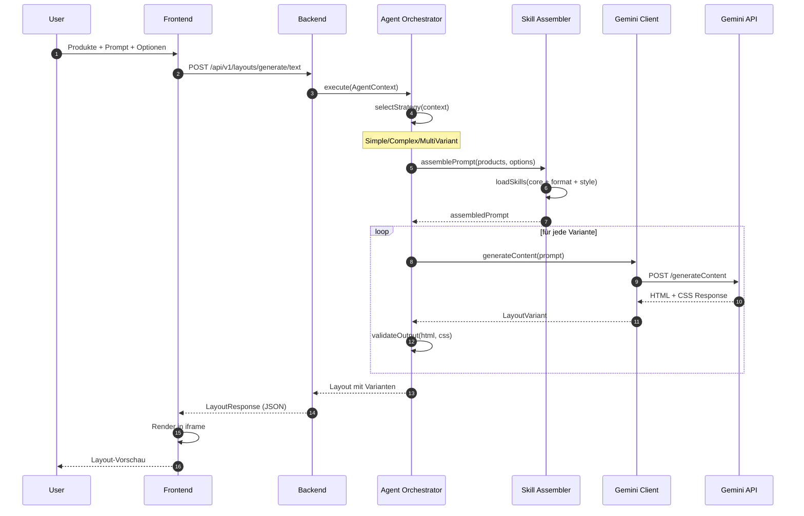
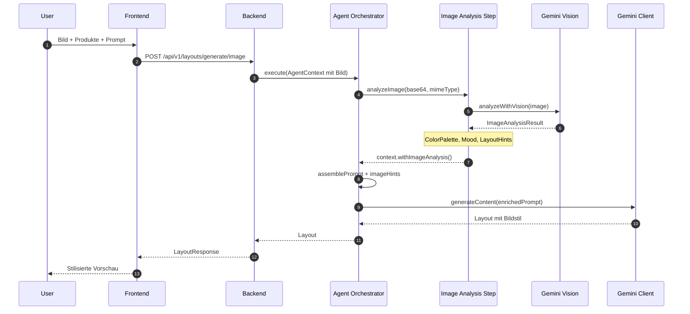
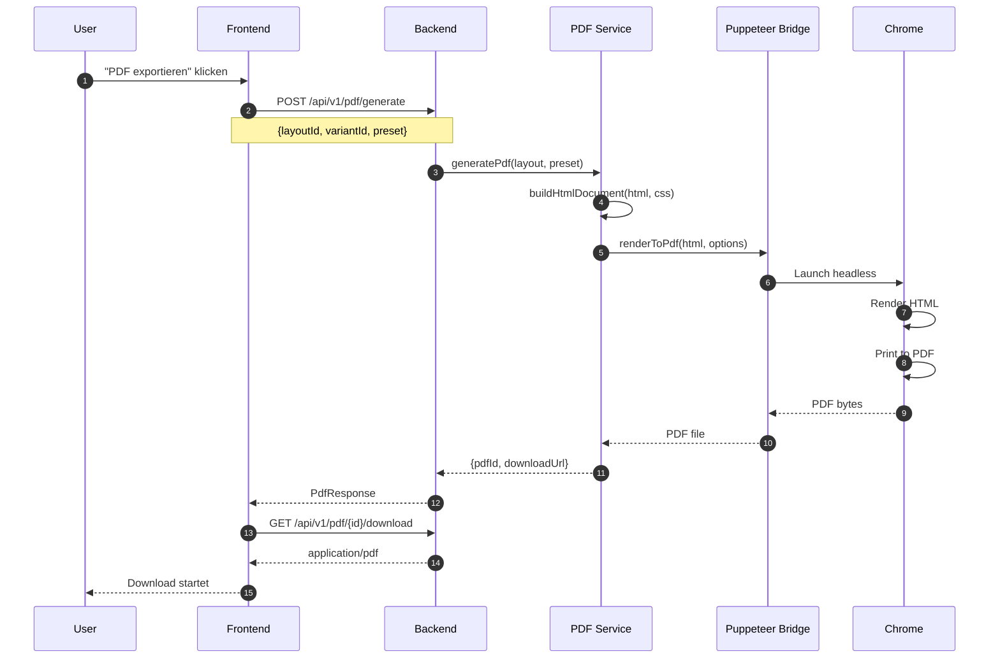
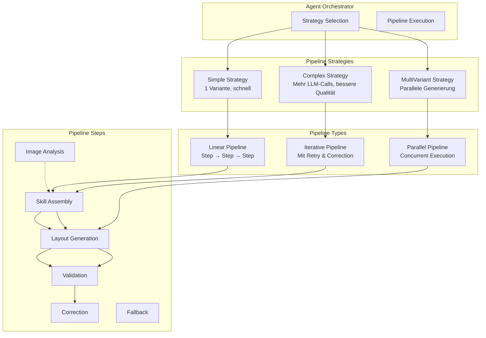
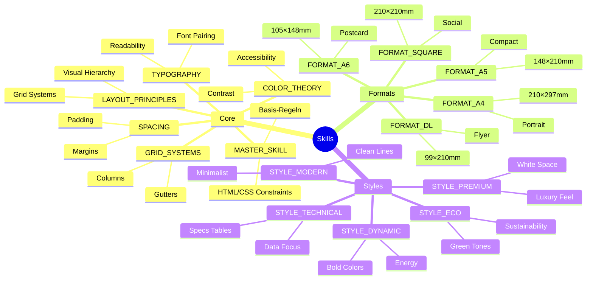
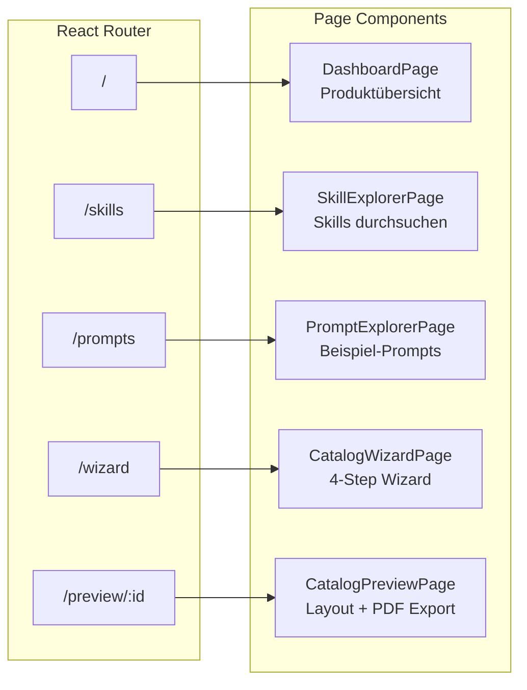
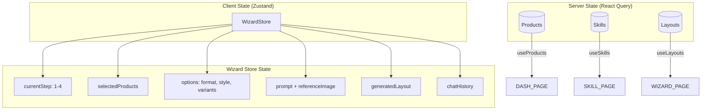
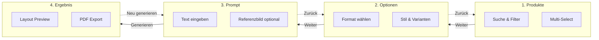

# CatalogForge

> KI-gestützte Katalog- und Flyer-Generierung: Von Text-Prompts und Referenzbildern zu druckfertigen HTML/CSS-Layouts und PDFs.


---

## Inhaltsverzeichnis

- [Systemarchitektur](#systemarchitektur)
- [Request Flow](#request-flow)
- [Tech Stack](#tech-stack)
- [Quick Start](#quick-start)
- [Projektstruktur](#projektstruktur)
- [Agent Framework](#agent-framework)
- [Skills System](#skills-system)
- [Frontend Architektur](#frontend-architektur)
- [API Referenz](#api-referenz)
- [Testing](#testing)
- [Bekannte Einschränkungen](#bekannte-einschränkungen)
- [Screenshots](#screenshots)

---

## Systemarchitektur

```
┌─────────────────────────────────────────────────────────────────────────────────┐
│                                   FRONTEND                                       │
│  ┌─────────────┐  ┌─────────────┐  ┌─────────────┐  ┌─────────────────────────┐ │
│  │  Dashboard  │  │   Wizard    │  │   Preview   │  │  Skill/Prompt Explorer  │ │
│  └──────┬──────┘  └──────┬──────┘  └──────┬──────┘  └────────────┬────────────┘ │
│         │                │                │                      │              │
│         └────────────────┴────────────────┴──────────────────────┘              │
│                                    │                                             │
│                          React Query + Zustand                                   │
│                                    │                                             │
└────────────────────────────────────┼─────────────────────────────────────────────┘
                                     │ HTTP/REST
                                     ▼
┌────────────────────────────────────┴─────────────────────────────────────────────┐
│                                   BACKEND                                        │
│  ┌─────────────────────────────────────────────────────────────────────────────┐ │
│  │                           REST Controllers                                   │ │
│  │   /products  │  /layouts  │  /skills  │  /pdf  │  /images                   │ │
│  └───────┬──────────────┬─────────────┬──────────────┬──────────────┬──────────┘ │
│          │              │             │              │              │            │
│          ▼              ▼             ▼              ▼              ▼            │
│  ┌──────────────┐ ┌───────────────────────┐ ┌─────────────┐ ┌─────────────────┐  │
│  │   Product    │ │   Layout Generation   │ │   Skills    │ │  PDF Generation │  │
│  │   Service    │ │       Service         │ │   Service   │ │     Service     │  │
│  └──────┬───────┘ └───────────┬───────────┘ └──────┬──────┘ └────────┬────────┘  │
│         │                     │                    │                 │           │
│         │                     ▼                    │                 │           │
│         │         ┌───────────────────────┐        │                 │           │
│         │         │   Agent Orchestrator  │◄───────┘                 │           │
│         │         │  ┌─────────────────┐  │                          │           │
│         │         │  │ Pipeline Steps  │  │                          │           │
│         │         │  │ • ImageAnalysis │  │                          │           │
│         │         │  │ • SkillAssembly │  │                          │           │
│         │         │  │ • Generation    │  │                          │           │
│         │         │  │ • Validation    │  │                          │           │
│         │         │  └─────────────────┘  │                          │           │
│         │         └───────────┬───────────┘                          │           │
│         │                     │                                      │           │
│         │                     ▼                                      ▼           │
│         │         ┌───────────────────────┐              ┌───────────────────┐   │
│         │         │    Gemini Client      │              │  Puppeteer Bridge │   │
│         │         │  (Vision + Text LLM)  │              │   (Node.js PDF)   │   │
│         │         └───────────┬───────────┘              └─────────┬─────────┘   │
│         │                     │                                    │             │
└─────────┼─────────────────────┼────────────────────────────────────┼─────────────┘
          │                     │                                    │
          ▼                     ▼                                    ▼
   ┌─────────────┐      ┌─────────────┐                      ┌─────────────┐
   │ products.   │      │  Google     │                      │  Headless   │
   │   json      │      │  Gemini API │                      │   Chrome    │
   └─────────────┘      └─────────────┘                      └─────────────┘
```

CatalogForge ist eine Full-Stack-Anwendung mit klarer Trennung zwischen React-Frontend und Spring Boot-Backend. Das Backend orchestriert LLM-Aufrufe über ein eigenes Agent-Framework und generiert PDFs via Puppeteer/Chrome.

---

## Request Flow

### Text-to-Layout Generation



### Image-to-Layout Generation



### PDF Export



---

## Tech Stack

### Backend

| Komponente | Technologie | Version | Zweck |
|------------|-------------|---------|-------|
| Runtime | Java | 21 LTS | Records, Pattern Matching, Virtual Threads |
| Framework | Spring Boot | 3.4.1 | REST API, WebFlux |
| Build | Gradle | 8.x | Kotlin DSL |
| LLM | Google Gemini | API | Text + Vision Generation |
| PDF | Puppeteer | Node.js | Headless Chrome Rendering |

### Frontend

| Komponente | Technologie | Version | Zweck |
|------------|-------------|---------|-------|
| UI | React | 18.2 | Component Library |
| Language | TypeScript | 5.3 | Type Safety |
| Build | Vite | 5.1 | Dev Server + Bundling |
| Styling | Tailwind CSS | 3.4 | Utility-First CSS |
| Server State | React Query | 5.24 | API Caching |
| Client State | Zustand | 4.5 | Wizard State |
| Charts | Recharts | 2.12 | Dashboard Visualisierungen |

### Testing

| Stack | Backend | Frontend |
|-------|---------|----------|
| Framework | JUnit 5 | Vitest |
| Mocking | Mockito | - |
| Assertions | AssertJ | Testing Library |
| Property-Based | jqwik | fast-check |

---

## Quick Start

### Voraussetzungen

- Java 21+
- Node.js 18+ (für Frontend + Puppeteer)
- Google Gemini API Key

### 1. Repository klonen

```bash
git clone <repository-url>
cd catalogforge
```

### 2. Backend starten

```bash
cd catForge-backend

# Environment konfigurieren
cp .env.example .env
# GEMINI_API_KEY in .env eintragen

# Starten
./gradlew bootRun
```

Backend läuft auf `http://localhost:8080`

### 3. Frontend starten

```bash
cd catForge-frontend

# Dependencies installieren
npm install

# Dev Server starten
npm run dev
```

Frontend läuft auf `http://localhost:3000` (Proxy zu Backend konfiguriert)

### 4. Anwendung öffnen

Browser öffnen: `http://localhost:3000`

### Wichtige Befehle

```bash
# Backend
./gradlew bootRun              # Starten
./gradlew test                 # Alle Tests
./gradlew unitTest             # Unit Tests
./gradlew propertyTest         # Property-Based Tests

# Frontend
npm run dev                    # Dev Server
npm run build                  # Production Build
npm run test                   # Tests (single run)
npm run test:coverage          # Coverage Report
```

---

## Projektstruktur


```
catalogforge/
├── catForge-backend/                 # Spring Boot Backend
│   ├── src/main/java/com/catalogforge/
│   │   ├── agent/                    # Agent Framework
│   │   │   ├── steps/                # Pipeline Steps
│   │   │   └── strategies/           # Simple, Complex, MultiVariant
│   │   ├── config/                   # Spring Configuration
│   │   ├── controller/               # REST Endpoints
│   │   ├── gemini/                   # Gemini API Client
│   │   ├── model/                    # Domain Models (Records)
│   │   ├── pdf/                      # Puppeteer Bridge
│   │   ├── service/                  # Business Logic
│   │   ├── skill/                    # Skill Loading
│   │   └── util/                     # Validators, Sanitizers
│   ├── src/main/resources/
│   │   ├── data/products.json        # Produktkatalog
│   │   └── skills/                   # Prompt Engineering
│   │       ├── core/                 # MASTER_SKILL, TYPOGRAPHY, etc.
│   │       ├── formats/              # A4, A5, DL, A6, SQUARE
│   │       └── styles/               # MODERN, TECHNICAL, PREMIUM, etc.
│   └── scripts/
│       └── pdf-generator.js          # Puppeteer Script
│
├── catForge-frontend/                # React Frontend
│   ├── src/
│   │   ├── api/                      # API Client Layer
│   │   ├── components/
│   │   │   ├── ui/                   # Button, Card, Modal, etc.
│   │   │   ├── charts/               # PieChart, BarChart, StatCard
│   │   │   ├── layout/               # AppLayout, Sidebar, Header
│   │   │   └── features/             # Feature Components
│   │   │       ├── wizard/           # ProductSelector, LayoutOptions
│   │   │       ├── preview/          # LayoutPreview, VariantSelector
│   │   │       ├── skills/           # SkillCard, SkillDetail
│   │   │       └── prompts/          # PromptCard, PromptDetail
│   │   ├── pages/                    # Route Pages
│   │   │   ├── Dashboard/
│   │   │   ├── CatalogWizard/
│   │   │   ├── CatalogPreview/
│   │   │   ├── SkillExplorer/
│   │   │   └── PromptExplorer/
│   │   ├── hooks/                    # useProducts, useLayouts, etc.
│   │   ├── store/                    # Zustand Stores
│   │   └── utils/                    # Helpers, Formatters
│   └── index.html
│
├── dev_doc/                          # Dokumentation & Screenshots
│   ├── api-analyse.md
│   ├── frontend-spezifikation.md
│   └── app-v1-screenshots/           # UI Screenshots
│
└── .kiro/                            # Kiro IDE Config
    ├── steering/                     # Coding Guidelines
    └── specs/                        # Feature Specs
```

---

## Agent Framework



### AgentContext (Immutable State)

```java
// Immutable Record mit withX() Pattern
public record AgentContext(
    String pipelineId,
    List<Product> products,
    LayoutOptions options,
    String userPrompt,
    String imageBase64,           // Optional: Referenzbild
    ImageAnalysisResult analysis, // Optional: Vision-Ergebnis
    String assembledPrompt,
    Layout generatedLayout,
    List<String> validationErrors,
    int retryCount
) {
    // Factory Methods
    public static AgentContext forTextGeneration(...) { }
    public static AgentContext forImageGeneration(...) { }
    
    // Immutable Updates
    public AgentContext withAssembledPrompt(String prompt) { }
    public AgentContext withGeneratedLayout(Layout layout) { }
    public AgentContext withValidationErrors(List<String> errors) { }
}
```

---

## Skills System



### Skill Composition

```
┌─────────────────────────────────────────────────────────────┐
│                    Assembled Prompt                          │
├─────────────────────────────────────────────────────────────┤
│  ┌─────────────────────────────────────────────────────┐    │
│  │                   MASTER_SKILL                       │    │
│  │  • HTML/CSS Output Rules                            │    │
│  │  • Print-Ready Constraints                          │    │
│  │  • Safety Zones & Bleed                             │    │
│  └─────────────────────────────────────────────────────┘    │
│                          +                                   │
│  ┌─────────────────────────────────────────────────────┐    │
│  │              Core Skills (auto-included)             │    │
│  │  TYPOGRAPHY + COLOR_THEORY + SPACING + GRID         │    │
│  └─────────────────────────────────────────────────────┘    │
│                          +                                   │
│  ┌─────────────────────────────────────────────────────┐    │
│  │                   FORMAT_A4                          │    │
│  │  • Dimensions: 210×297mm                            │    │
│  │  • Safe Zone: 10mm margins                          │    │
│  │  • Bleed: 3mm                                       │    │
│  └─────────────────────────────────────────────────────┘    │
│                          +                                   │
│  ┌─────────────────────────────────────────────────────┐    │
│  │                  STYLE_MODERN                        │    │
│  │  • Clean typography                                 │    │
│  │  • Generous whitespace                              │    │
│  │  • Subtle color accents                             │    │
│  └─────────────────────────────────────────────────────┘    │
│                          +                                   │
│  ┌─────────────────────────────────────────────────────┐    │
│  │                   User Prompt                        │    │
│  │  "Erstelle eine Produktseite für den eActros 600    │    │
│  │   mit Fokus auf Umweltvorteile..."                  │    │
│  └─────────────────────────────────────────────────────┘    │
│                          +                                   │
│  ┌─────────────────────────────────────────────────────┐    │
│  │                  Product Data                        │    │
│  │  • Name, Description, Specs                         │    │
│  │  • Highlights, Price                                │    │
│  │  • Image URL                                        │    │
│  └─────────────────────────────────────────────────────┘    │
└─────────────────────────────────────────────────────────────┘
```

---

## Frontend Architektur


### Routing & Pages



### State Management



### Wizard Flow



**Wizard UI Layout:**

```
┌─────────────────────────────────────────────────────────────────────────────┐
│  Katalog erstellen                                                          │
│  ━━━━━━━━━━━━━━━━━━━━━━━━━━━━━━━━━━━━━━━━━━━━━━━━━━━━━━━━━━━━━━━━━━━━━━━━━ │
│  [1. Produkte] → [2. Optionen] → [3. Prompt] → [4. Ergebnis]                │
├─────────────────────────────────────────────────────────────────────────────┤
│                                                                             │
│  ┌─────────────────────────────────────────────────────────────────────┐   │
│  │                                                                     │   │
│  │                     STEP CONTENT AREA                               │   │
│  │                                                                     │   │
│  │  Step 1: Produktauswahl mit Suche, Filter, Multi-Select            │   │
│  │  Step 2: Format (A4/A5/DL), Stil, Varianten-Slider                 │   │
│  │  Step 3: Prompt-Textarea, Bild-Upload, Chat-Interface              │   │
│  │  Step 4: Layout-Preview (iframe), Varianten-Tabs, PDF-Export       │   │
│  │                                                                     │   │
│  └─────────────────────────────────────────────────────────────────────┘   │
│                                                                             │
│                                           [← Zurück]  [Weiter →]            │
└─────────────────────────────────────────────────────────────────────────────┘
```

| Schritt | Funktion | Beschreibung |
|---------|----------|--------------|
| 1. Produkte | Auswahl | Suche, Filter nach Kategorie/Serie, Multi-Select |
| 2. Optionen | Konfiguration | Format (A4, A5, DL...), Stil, Varianten (1-5) |
| 3. Prompt | Eingabe | Text-Beschreibung, optionales Referenzbild, Chat |
| 4. Ergebnis | Vorschau | Layout-Preview, Varianten-Tabs, PDF Export |

---

## API Referenz

### Base URL: `/api/v1`

### Products API

| Method | Endpoint | Beschreibung |
|--------|----------|--------------|
| `GET` | `/products` | Alle Produkte (optional: `?category=`, `?series=`) |
| `GET` | `/products/{id}` | Einzelnes Produkt |
| `GET` | `/products/categories` | Alle Kategorien |
| `GET` | `/products/series` | Alle Baureihen |
| `GET` | `/products/search?q={query}` | Volltextsuche |

### Layouts API

| Method | Endpoint | Beschreibung |
|--------|----------|--------------|
| `POST` | `/layouts/generate/text` | Text-to-Layout |
| `POST` | `/layouts/generate/image` | Image-to-Layout |
| `GET` | `/layouts/{id}` | Layout abrufen |
| `GET` | `/layouts/{id}/variants` | Alle Varianten |
| `DELETE` | `/layouts/{id}` | Layout löschen |

### Skills API

| Method | Endpoint | Beschreibung |
|--------|----------|--------------|
| `GET` | `/skills` | Alle Skills |
| `GET` | `/skills/categories` | Skill-Kategorien |
| `GET` | `/skills/{category}` | Skills einer Kategorie |
| `GET` | `/skills/prompts/examples` | Beispiel-Prompts |

### PDF API

| Method | Endpoint | Beschreibung |
|--------|----------|--------------|
| `POST` | `/pdf/generate` | PDF generieren |
| `GET` | `/pdf/{id}/download` | PDF herunterladen |
| `GET` | `/pdf/presets` | Print-Presets |

### Request/Response Beispiele

<details>
<summary><b>POST /layouts/generate/text</b></summary>

**Request:**
```json
{
  "productIds": [1, 6],
  "options": {
    "pageFormat": "A4",
    "style": "modern",
    "variantCount": 2,
    "includeSpecs": true
  },
  "prompt": "Erstelle eine Produktvergleichsseite für Actros L und eActros 600 mit Fokus auf Effizienz."
}
```

**Response:**
```json
{
  "id": "550e8400-e29b-41d4-a716-446655440000",
  "status": "success",
  "generatedAt": "2025-01-15T14:30:00Z",
  "pageFormat": "A4",
  "variantCount": 2,
  "variants": [
    {
      "id": "variant-1",
      "html": "<div class=\"catalog-page\">...</div>",
      "css": ".catalog-page { ... }"
    },
    {
      "id": "variant-2",
      "html": "<div class=\"catalog-page\">...</div>",
      "css": ".catalog-page { ... }"
    }
  ]
}
```
</details>

<details>
<summary><b>POST /pdf/generate</b></summary>

**Request:**
```json
{
  "layoutId": "550e8400-e29b-41d4-a716-446655440000",
  "variantId": "variant-1",
  "preset": "print-professional"
}
```

**Response:**
```json
{
  "pdfId": "pdf-123",
  "downloadUrl": "/api/v1/pdf/pdf-123/download"
}
```
</details>

### Print Presets

| Preset | DPI | Bleed | Crop Marks | Verwendung |
|--------|-----|-------|------------|------------|
| `screen` | 72 | 0mm | ❌ | Bildschirmansicht |
| `print-standard` | 150 | 0mm | ❌ | Office-Druck |
| `print-professional` | 300 | 3mm | ✅ | Professioneller Druck |
| `print-premium` | 300 | 5mm | ✅ | Premium-Druck |

---

## Testing

### Backend Tests

```bash
# Alle Tests
./gradlew test

# Nach Tags filtern
./gradlew unitTest          # @Tag("unit")
./gradlew integrationTest   # @Tag("integration")
./gradlew propertyTest      # @Tag("property")

# Coverage Report
./gradlew jacocoTestReport
# Report: build/reports/jacoco/test/html/index.html
```

### Frontend Tests

```bash
# Single Run
npm run test

# Watch Mode
npm run test:watch

# Coverage
npm run test:coverage
```

### Test-Kategorien

| Kategorie | Backend | Frontend |
|-----------|---------|----------|
| Unit | JUnit 5 + Mockito | Vitest |
| Property-Based | jqwik | fast-check |
| Component | - | Testing Library |
| Integration | Spring Test | - |

---

## Bekannte Einschränkungen

### Aktueller Status (v1)

| Feature | Status | Anmerkung |
|---------|--------|-----------|
| Text-to-Layout | ✅ Funktioniert | - |
| Image-to-Layout | ✅ Funktioniert | - |
| Layout Preview | ✅ Funktioniert | - |
| PDF Export | ⚠️ Teilweise | Liefert aktuell leeres PDF |
| Produktbilder | ⚠️ Teilweise | Dummy-URLs, manche nicht erreichbar |
| DevContainer | 🚧 In Arbeit | Noch ungetestet, Frontend-Integration ausstehend |

### Bekannte Issues

1. **PDF Export**: Generiert aktuell leere PDFs - Puppeteer-Integration muss debuggt werden
2. **Produktbilder**: Verwenden Unsplash-Placeholder, einige URLs nicht mehr gültig
3. **DevContainer**: Konfiguration für Backend vorhanden, Frontend-Integration fehlt noch

---

## Screenshots

Screenshots der Anwendung (v1) befinden sich im Ordner `dev_doc/app-v1-screenshots/`.

Die Screenshots zeigen:
- Dashboard mit Produktübersicht und Charts
- Skill Explorer mit Kategorie-Filter
- Prompt Explorer mit Beispiel-Prompts
- Catalog Wizard (alle 4 Schritte)
- Layout Preview mit Varianten-Auswahl

---

## Weitere Dokumentation

| Dokument | Pfad | Inhalt |
|----------|------|--------|
| API Analyse | `dev_doc/api-analyse.md` | Vollständige API-Dokumentation |
| Frontend Spec | `dev_doc/frontend-spezifikation.md` | UI/UX Spezifikation |
| Steering Rules | `.kiro/steering/` | Coding Guidelines |

---

## Lizenz

Proprietär - Daimler Truck AG
