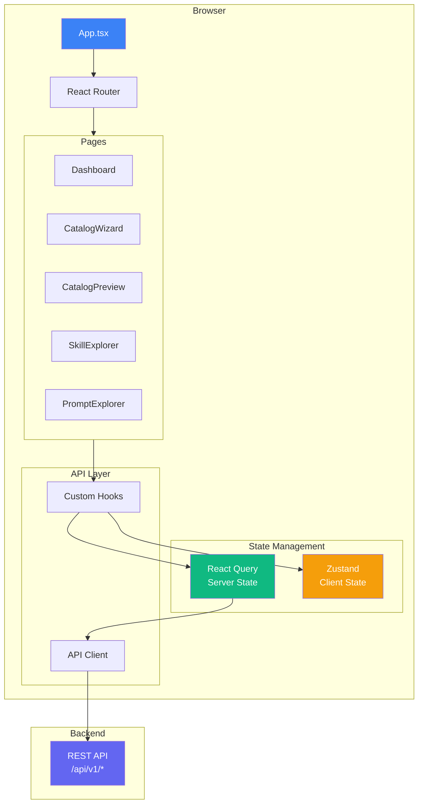
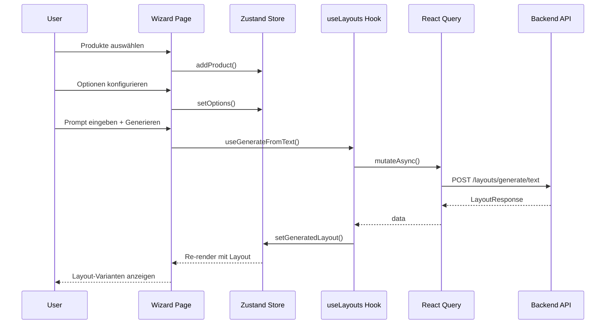
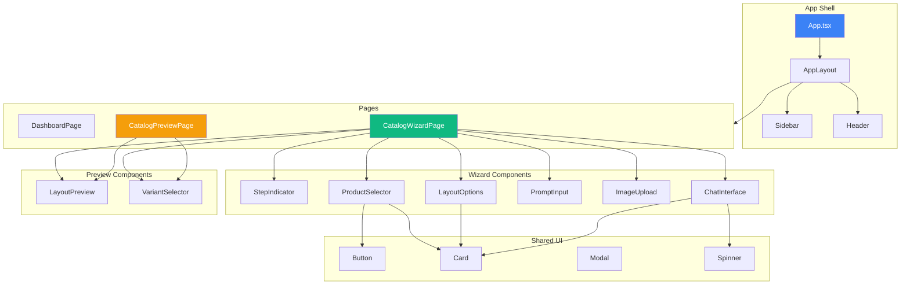
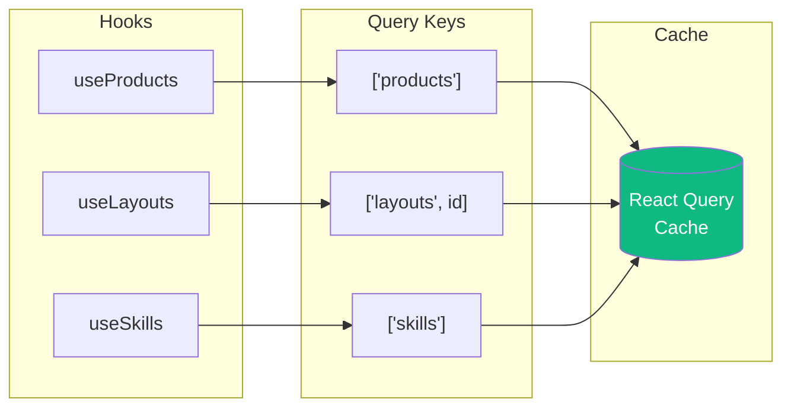
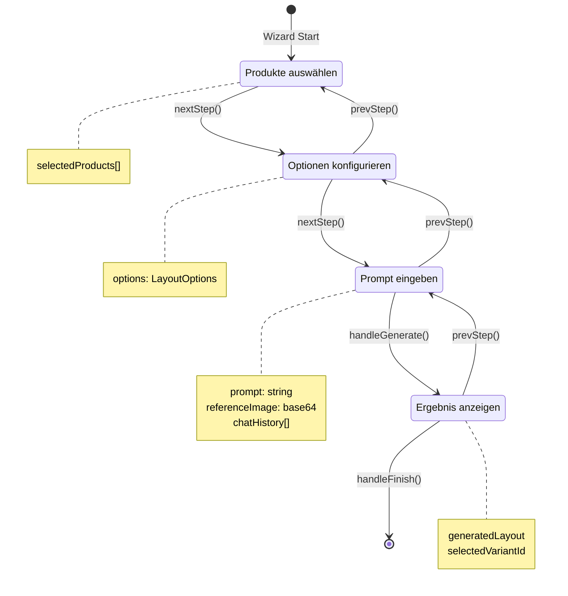
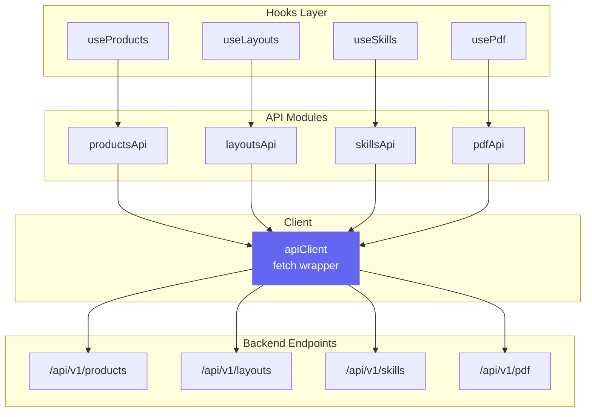
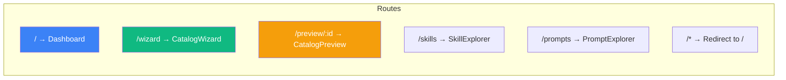

> ⚠️ **Hinweis: 100% KI-generiertes Projekt**
>
> Dieses Projekt wurde vollständig mit KI erstellt und dient als Test der **KIRO IDE** und deren **Spec-Driven Development** Ansatz. Die Spezifikationen wurden in mehreren Claude-Chat-Sessions erarbeitet (Context Engineering), anschließend wurde die Task-Liste aus dieser Spec mit Kiro generiert. Die Implementierung erfolgte mit **Opus 4.5**.

---

# CatalogForge Frontend

React-basierte Single-Page-Application für die KI-gestützte Katalog- und Flyer-Generierung. Transformiert Text-Prompts und Referenzbilder in professionelle, druckfertige HTML/CSS-Layouts.

## Quick Start

```bash
# Dependencies installieren
npm install

# Development Server starten (Port 3000)
npm run dev

# Tests ausführen
npm run test

# Production Build
npm run build
```

> **Voraussetzung:** Backend muss auf `http://localhost:8080` laufen (wird automatisch geproxied).

---

## Architektur-Übersicht



---

## Datenfluss



---

## Projektstruktur

```
src/
├── api/                 # API-Schicht
│   ├── client.ts        # Fetch-Wrapper mit Error Handling
│   ├── types.ts         # TypeScript Interfaces
│   ├── layouts.ts       # Layout-Generierung Endpoints
│   ├── products.ts      # Produktkatalog Endpoints
│   ├── skills.ts        # Skills-System Endpoints
│   ├── images.ts        # Bild-Upload Endpoints
│   └── pdf.ts           # PDF-Export Endpoints
│
├── components/
│   ├── charts/          # Recharts Visualisierungen
│   │   ├── BarChart.tsx
│   │   ├── PieChart.tsx
│   │   └── StatCard.tsx
│   │
│   ├── features/        # Feature-spezifische Komponenten
│   │   ├── preview/     # Layout-Vorschau
│   │   ├── products/    # Produktanzeige
│   │   ├── prompts/     # Prompt Explorer
│   │   ├── skills/      # Skills Explorer
│   │   └── wizard/      # Katalog-Wizard Steps
│   │
│   ├── layout/          # App Shell
│   │   ├── AppLayout.tsx
│   │   ├── Sidebar.tsx
│   │   ├── Header.tsx
│   │   └── PageContainer.tsx
│   │
│   └── ui/              # Wiederverwendbare UI-Primitives
│       ├── Button.tsx
│       ├── Card.tsx
│       ├── Modal.tsx
│       ├── Input.tsx
│       └── ...
│
├── hooks/               # Custom React Hooks
│   ├── useLayouts.ts    # Layout-Generierung mit React Query
│   ├── useProducts.ts   # Produkt-Fetching
│   ├── useSkills.ts     # Skills-Fetching
│   ├── usePdf.ts        # PDF-Export
│   └── useDebounce.ts   # Input Debouncing
│
├── pages/               # Route Pages
│   ├── Dashboard/       # Übersicht mit Statistiken
│   ├── CatalogWizard/   # Multi-Step Wizard
│   ├── CatalogPreview/  # Layout-Vorschau + PDF-Export
│   ├── SkillExplorer/   # Skills durchsuchen
│   └── PromptExplorer/  # Prompt-Historie
│
├── store/               # Zustand Stores
│   └── wizardStore.ts   # Wizard State Management
│
├── utils/               # Utility Functions
│   ├── cn.ts            # Tailwind Class Merging
│   ├── formatters.ts    # Datum/Zahlen Formatierung
│   ├── validators.ts    # Form Validation
│   ├── filters.ts       # Produkt-Filterung
│   └── pageFormats.ts   # Druckformat Utilities
│
└── styles/
    └── globals.css      # Tailwind Base Styles
```

---

## Komponenten-Hierarchie



---

## State Management

### Server State (React Query)



**Konfiguration:**
- `staleTime: 5 Minuten` – Daten gelten 5 Min. als frisch
- `retry: 1` – Ein Retry bei Fehlern
- Automatisches Cache-Update nach Mutations

### Client State (Zustand)



**Wizard Store Interface:**
```typescript
interface WizardState {
  // Navigation
  currentStep: 1 | 2 | 3 | 4;
  
  // Step 1: Products
  selectedProducts: Product[];
  
  // Step 2: Options
  options: LayoutOptions;
  
  // Step 3: Prompt
  prompt: string;
  referenceImage: { base64: string; mimeType: string } | null;
  chatHistory: ChatMessage[];
  
  // Step 4: Result
  generatedLayout: LayoutResponse | null;
  selectedVariantId: string | null;
  
  // Status
  isGenerating: boolean;
  error: string | null;
}
```

---

## API-Schicht



### Wichtige Endpoints

| Endpoint | Methode | Beschreibung |
|----------|---------|--------------|
| `/layouts/generate/text` | POST | Layout aus Text-Prompt generieren |
| `/layouts/generate/image` | POST | Layout aus Referenzbild generieren |
| `/layouts/{id}` | GET | Layout abrufen |
| `/products` | GET | Alle Produkte laden |
| `/skills` | GET | Verfügbare Skills laden |
| `/pdf/generate` | POST | PDF aus Layout generieren |

---

## Routing



**Features:**
- Lazy Loading aller Pages via `React.lazy()`
- Suspense Fallback mit Spinner
- Catch-all Route redirected zu Dashboard

---

## Tech Stack

| Kategorie | Technologie | Version |
|-----------|-------------|---------|
| **UI Library** | React | 18.2 |
| **Type Safety** | TypeScript | 5.3 |
| **Build Tool** | Vite | 5.1 |
| **Styling** | Tailwind CSS | 3.4 |
| **Routing** | React Router | 6.22 |
| **Server State** | React Query | 5.24 |
| **Client State** | Zustand | 4.5 |
| **Forms** | React Hook Form | 7.50 |
| **Charts** | Recharts | 2.12 |
| **Icons** | Lucide React | 0.330 |
| **Testing** | Vitest + Testing Library | 1.3 / 14.2 |

---

## Testing

```bash
# Alle Tests ausführen
npm run test

# Watch Mode
npm run test:watch

# Coverage Report
npm run test:coverage
```

### Test-Struktur

```
src/
├── api/
│   └── errors.test.ts           # API Error Handling
├── components/
│   ├── ui/
│   │   ├── Button.test.tsx
│   │   └── Badge.test.tsx
│   ├── layout/
│   │   └── Sidebar.test.tsx
│   └── features/
│       ├── wizard/wizard.test.ts
│       ├── skills/skills.test.ts
│       └── prompts/prompts.test.ts
├── store/
│   └── wizardStore.test.ts      # Zustand Store Tests
└── utils/
    ├── filters.test.ts
    ├── aggregations.test.ts
    └── pageFormats.test.ts
```

### Test-Patterns

```typescript
// Component Test mit Testing Library
import { render, screen, fireEvent } from '@testing-library/react';
import { Button } from './Button';

describe('Button', () => {
  it('renders children', () => {
    render(<Button>Click me</Button>);
    expect(screen.getByText('Click me')).toBeInTheDocument();
  });
});

// Property-Based Test mit fast-check
import fc from 'fast-check';

describe('filterProducts', () => {
  it('returns subset of input', () => {
    fc.assert(
      fc.property(fc.array(productArbitrary), (products) => {
        const filtered = filterProducts(products, {});
        return filtered.length <= products.length;
      })
    );
  });
});
```

---

## Entwicklung

### Lokale Entwicklung

```bash
# Frontend starten
npm run dev

# Backend muss separat laufen auf Port 8080
# Vite proxied /api/* automatisch
```

### Code Conventions

**TypeScript:**
- Interfaces für Object Shapes
- Types für Unions
- Strict Mode aktiviert
- Kein `any`

**Components:**
- Functional Components mit Hooks
- Props Destructuring mit TypeScript Interface
- Co-located Tests (`Component.test.tsx`)

**Styling:**
- Tailwind CSS für alles
- `cn()` Utility für conditional Classes
- Keine Inline Styles

**State:**
- Server State → React Query
- Client State → Zustand
- Local UI State → useState

### Path Aliases

```typescript
// Statt relativer Pfade
import { Button } from '../../../components/ui/Button';

// Mit Alias
import { Button } from '@/components/ui';
```

Konfiguriert in `vite.config.ts` und `tsconfig.json`.

---

## Umgebungsvariablen

```bash
# .env.example
VITE_API_URL=/api/v1  # Optional, Default ist /api/v1
```

---

## Scripts

| Script | Beschreibung |
|--------|--------------|
| `npm run dev` | Development Server (Port 3000) |
| `npm run build` | Production Build |
| `npm run preview` | Preview Production Build |
| `npm run test` | Tests ausführen (single run) |
| `npm run test:watch` | Tests im Watch Mode |
| `npm run test:coverage` | Coverage Report |
| `npm run lint` | ESLint Check |

---

## Weiterführende Dokumentation

- [Frontend Spezifikation](../dev_doc/frontend-spezifikation.md)
- [API Analyse](../dev_doc/api-analyse.md)
- [Backend README](../catForge-backend/README.md)
