# Entwicklungsdokumentation — CatalogForge

> Dieses Dokument beschreibt den vollständigen Entwicklungsprozess von CatalogForge: Von der ersten Idee über Spezifikation und Implementierung bis zu Migrations-Guides. Es dient als Playbook für KI-gestütztes Software Engineering mit Claude und Kiro IDE.

---

## Projekt-Steckbrief

| Kennzahl | Wert |
|----------|------|
| Entwicklungszeitraum | 24.–27. Dezember 2025 (4 Tage) |
| Commits | 99 |
| Geschätzte Arbeitszeit | ~40 Stunden |
| Backend-Entwicklung | ~8,5h · 32 Commits |
| Frontend-Entwicklung | ~6h · 51 Commits |
| Optimierung & Docs | ~12h · 13 Commits |
| Finalisierung | ~14h · 3 Commits |
| Entwickler | 1 (Solo-Projekt) |

→ Vollständige Analyse mit Visualisierungen: [git-historie-analyse.md](./git-historie-analyse.md)

---

## Toolchain

| Tool | Einsatz | Phasen |
|------|---------|--------|
| [Claude](https://claude.ai) (Chat) | Spezifikation, Sparring, Context Engineering | 1–4, 6–7, 9–10 |
| [Kiro IDE](https://kiro.dev) | Spec-Driven Development (Requirements → Design → Tasks) | 5, 8 |
| Opus 4.5 (via Kiro) | Code-Generierung und Implementierung | 5, 8 |
| [Repomix](https://repomix.com) | Codebase als XML für LLM-Input | 9, 10 |

### Repomix-Outputs im Repository

| Datei | Inhalt |
|-------|--------|
| [repomix-output.xml](./repomix-output.xml) | Backend-Code als XML (Input für Session 9) |
| [repomix-output-react.xml](./repomix-output-react.xml) | Frontend-Code als XML (Input für Session 10) |

---

## Implementierungs-Workflow (10 Phasen)

### Detaillierter Workflow

| Phase | Name | Beschreibung | Output |
|:-----:|------|--------------|--------|
| 1 | Datenmodellierung | Dummy-Daten Konzept, JSON-Schema, Dokumentation | [JSON-Schema](../catForge-backend/daimler_truck_katalog_schema.json) + [Docs](../catForge-backend/daimler_truck_katalog_schema_dokumentation.md) |
| 2 | Backend-Spezifikation | Schema, Spec v1, Refinement, Spec v2 | Backend-Spec v2 (Claude Artifact) |
| 3 | Test-Spezifikation | Backend-Spec, Briefing, Test-Spec | Test-Spec (Claude Artifact) |
| 4 | Finale Spezifikation | Backend + Test-Spec, Zusammenführung + Diagramme | [CATALOGFORGE_IMPLEMENTATION_SPEC.md](../CATALOGFORGE_IMPLEMENTATION_SPEC.md) |
| 5 | Backend-Implementierung | Kiro SDD: Requirements, Design, Tasks, Opus 4.5 | [catForge-backend/](../catForge-backend/) |
| 6 | Backend-Dokumentation | Backend analysieren, API-Analyse generieren | [api-analyse.md](./api-analyse.md) |
| 7 | Frontend-Spezifikation | API-Analyse, Frontend-Spec erstellen | [frontend-spezifikation.md](./frontend-spezifikation.md) |
| 8 | Frontend-Implementierung | Kiro SDD: Requirements, Design, Tasks, Opus 4.5 | [catForge-frontend/](../catForge-frontend/) |
| 9 | Java Migration Guide | Java 21→25 + Spring Boot 3.4→4.0 | [catalogforge-migration-analysis.md](./catalogforge-migration-analysis.md) |
| 10 | Vue Migration Guide | React→Vue 3.5 | [MIGRATION_GUIDE_REACT_TO_VUE.md](./MIGRATION_GUIDE_REACT_TO_VUE.md) |

---

## Kiro Spec-Driven Development Prozess

```mermaid
flowchart LR
    subgraph Input["📄 Input"]
        SPEC[Spezifikation]
    end

    subgraph Kiro["🔧 Kiro IDE SDD"]
        REQ[Requirements<br/>Was soll gebaut werden?]
        DES[Design<br/>Wie soll es gebaut werden?]
        TSK[Tasks<br/>Einzelne Arbeitsschritte]
    end

    subgraph Output["🚀 Output"]
        IMPL[Implementierung<br/>mit Opus 4.5]
    end

    SPEC --> REQ
    REQ --> DES
    DES --> TSK
    TSK --> IMPL

    style SPEC fill:#dbeafe,stroke:#2563eb
    style REQ fill:#dcfce7,stroke:#16a34a
    style DES fill:#fef3c7,stroke:#d97706
    style TSK fill:#f3e8ff,stroke:#9333ea
    style IMPL fill:#ffe4e6,stroke:#e11d48
```

### Backend SDD Artefakte

| Artefakt | Beschreibung | Pfad |
|----------|--------------|------|
| Input-Spezifikation | Vollständige Backend-Spec | [CATALOGFORGE_IMPLEMENTATION_SPEC.md](../CATALOGFORGE_IMPLEMENTATION_SPEC.md) |
| Requirements | Was soll gebaut werden? | [requirements.md](../.kiro/specs/catalogforge-backend/requirements.md) |
| Design | Wie soll es gebaut werden? | [design.md](../.kiro/specs/catalogforge-backend/design.md) |
| Tasks | Einzelne Arbeitsschritte | [tasks.md](../.kiro/specs/catalogforge-backend/tasks.md) |

### Frontend SDD Artefakte

| Artefakt | Beschreibung | Pfad |
|----------|--------------|------|
| Input-Spezifikation | Frontend-Spec aus API-Analyse | [frontend-spezifikation.md](./frontend-spezifikation.md) |
| Requirements | Was soll gebaut werden? | [requirements.md](../.kiro/specs/catalogforge-frontend/requirements.md) |
| Design | Wie soll es gebaut werden? | [design.md](../.kiro/specs/catalogforge-frontend/design.md) |
| Tasks | Einzelne Arbeitsschritte | [tasks.md](../.kiro/specs/catalogforge-frontend/tasks.md) |

---

## Kiro-Konfiguration

Kiro verwendet Steering-Files als persistente Leitplanken, die über alle Sessions hinweg gelten. Sie definieren Projekt-Identität, Code-Konventionen und Tech-Stack.

### Steering-Files

| Datei | Inclusion | Beschreibung |
|-------|-----------|-------------|
| [product.md](../.kiro/steering/product.md) | `always` | Projekt-Identität: Core Functionality, Architecture Principles, Domain Context, Code Guidelines |
| [structure.md](../.kiro/steering/structure.md) | `always` | Projektstruktur, Code Conventions (Records, Immutable Context, Factory Methods), Testing Conventions |
| [tech.md](../.kiro/steering/tech.md) | `fileMatch` | Tech-Stack mit Versionen, Commands, Configuration — wird nur bei Code-Dateien geladen |

### Hooks

| Hook | Trigger | Aktion |
|------|---------|--------|
| [analyze-slide-images](../.kiro/hooks/analyze-slide-images.kiro.hook) | `fileCreated` in `dev_doc/slides/*.png` | Sollte neue Bilder per LLM analysieren und beschreiben |

Das ursprüngliche Ziel dieses Hooks war es, jedes neu hinzugefügte Slide-Bild automatisch durch ein LLM vertexten zu lassen — also eine Bildbeschreibung generieren und in die README einfügen. Das hat nicht funktioniert: Kiro kann (zum Testzeitpunkt) Bilder nur sehen, wenn sie direkt in den Chat eingefügt werden. Ein Hook, der auf `fileCreated` reagiert, hat keinen Zugriff auf den Bildinhalt. Der Hook wurde daher auf das reine Einfügen des Bildlinks reduziert.

Die Steering-Files sind ein zentraler Bestandteil des Kiro-SDD-Workflows: Sie sorgen dafür, dass das LLM bei jeder Interaktion die richtigen Konventionen und Constraints kennt — ohne dass man sie jedes Mal manuell in den Context laden muss.

---

## Prompt-Engineering Patterns

```mermaid
flowchart LR
    subgraph Pattern["Briefing → Work Pattern"]
        P1[📋 Briefing-Prompt] --> P2[🔍 LLM-Zusammenfassung]
        P2 --> P3{Verstanden?}
        P3 -->|Ja| P4[🛠️ Arbeitsauftrag]
        P3 -->|Nein| P1
        P4 --> P5[📄 Output/Artefakt]
    end

    subgraph Context["Context Engineering"]
        C1[Relevante Infos sammeln] --> C2[Noise vermeiden]
        C2 --> C3[Fokussierter Context]
    end

    Pattern -.-> Context

    style P1 fill:#dbeafe,stroke:#2563eb
    style P4 fill:#dcfce7,stroke:#16a34a
    style P5 fill:#f3e8ff,stroke:#9333ea
```

### Das Briefing-Pattern

Das zentrale Muster in allen Sessions:

1. **Briefing-Prompt**: Dem LLM alle relevanten Informationen geben (z.B. JSON-Schema, bestehende Spec, Code-Analyse)
2. **Verständnis prüfen**: Das LLM eine Zusammenfassung generieren lassen — so wird sichtbar, ob der Context korrekt aufgenommen wurde
3. **Korrigieren oder vertiefen**: Falls nötig, den Context nachschärfen oder in eine bestimmte Richtung lenken
4. **Arbeitsauftrag**: Erst wenn das Verständnis stimmt, den eigentlichen Task geben

Dieses Pattern zieht sich durch alle 10 Sessions und ist der Schlüssel zu qualitativ hochwertigen Outputs.

---

## Session-Management & Context Engineering

> **Eine Session = Eine Aufgabe**

Hab keine Scheu davor, neue Sessions zu erstellen. Das ist kein Zeichen von Ineffizienz — es ist essentiell für gutes Context Engineering. Als Developer liegt es in deiner Verantwortung, das Session-Management aktiv zu betreiben.

### Das Context Window als Array

Stell dir eine LLM-Session wie ein Array mit fester Größe vor. Einige Elemente sind fix, andere kontrollierst du:

```mermaid
block-beta
    columns 2
    
    CW["Context<br/>Window<br/>~200k<br/>Tokens"]:1
    
    block:ARRAY:1
        columns 1
        F1["System-Prompt"]
        F2["Tool-Definitionen"]
        F3["MCP-Configs"]
        V1["Deine Nachrichten"]
        V2["LLM-Antworten"]
        V3["Geladene Dateien"]
        space
        BORDER["━━━ Dumm-Zone Grenze ━━━"]
        space
        DUMB["Degradierte Performance"]
    end
    
    style CW fill:#dbeafe,stroke:#2563eb
    style F1 fill:#fee2e2,stroke:#dc2626
    style F2 fill:#fee2e2,stroke:#dc2626
    style F3 fill:#fee2e2,stroke:#dc2626
    style V1 fill:#dcfce7,stroke:#16a34a
    style V2 fill:#dcfce7,stroke:#16a34a
    style V3 fill:#dcfce7,stroke:#16a34a
    style BORDER fill:none,stroke:none
    style DUMB fill:#fef3c7,stroke:#d97706
```

**Legende:**
- 🔴 Fixe Elemente — System-Prompt, Tools, MCP (nicht änderbar, verbrauchen immer Tokens)
- 🟢 Variable Elemente — Deine Nachrichten, Antworten, Dateien (deine Kontrolle)
- 🟡 Dumm-Zone — Ab ca. 60–70% Füllstand des Context Windows degradiert die LLM-Qualität spürbar

### Best Practices

| ✅ Do | ❌ Don't |
|-------|----------|
| Eine Session pro klar definierter Aufgabe | Alles in einer endlosen Session |
| Relevante Infos gezielt laden | Ganze Codebases in den Context kippen |
| Briefing-Pattern für Context-Aufbau | Ohne Kontext direkt losarbeiten |
| Session beenden wenn Aufgabe erledigt | Session "für später" offen lassen |

---

## Session-Übersicht

```mermaid
flowchart TB
    subgraph Spec[Spezifikation — Claude]
        direction LR
        S1[Phase 1: Daten] --> S2[Phase 2: Backend] --> S3[Phase 3: Tests] --> S4[Phase 4: Finale]
    end
    
    subgraph Backend[Backend — Kiro]
        direction LR
        B5[Phase 5: Impl] --> B6[Phase 6: Doku]
    end
    
    subgraph Frontend[Frontend — Kiro]
        direction LR
        F7[Phase 7: Spec] --> F8[Phase 8: Impl]
    end
    
    subgraph Migration[Migration — Claude]
        direction LR
        M9[Phase 9: Java] --> M10[Phase 10: Vue]
    end
    
    Spec --> Backend --> Frontend -.-> Migration
    
    style Spec fill:#dbeafe,stroke:#2563eb
    style Backend fill:#dcfce7,stroke:#16a34a
    style Frontend fill:#fef3c7,stroke:#d97706
    style Migration fill:#f3e8ff,stroke:#9333ea
```

---

## Einblick in die Prompting-Sessions

Mein Ziel ist es, Schritt für Schritt eine Spezifikation zu erstellen, die ich lesen kann und bei der ich denke: „Okay, das könnte mit den Informationen funktionieren und etwas Sinnvolles dabei rauskommen."

Die ganzen Chats sind alle in Claude entstanden. Java-Version und Spring-Boot-Version habe ich nicht vorgegeben und lebe aktuell mit dem Trainings-Cut-off der Modelle (und ich will auch nicht zu viel „Lärm" und vielleicht verwirrende Informationen in den Chat-Context streuen — also auch kein Context7-Einsatz). Mein Ziel mit der Spezifikation ist es, dass dort alles steht, was du zum Implementieren benötigst.

---

### Session 1: Dummy-Daten generieren

Mein initialer Chat, um die Dummy-Daten zu generieren:

- **Chat**: https://claude.ai/share/fd92ee80-a168-4f36-9482-5c1678c99f9d
- **JSON-Schema**: https://claude.ai/public/artifacts/c4bfb432-eb17-45cd-929b-337b26b0938d
- **JSON-Schema-Dokumentation**: https://claude.ai/public/artifacts/957556f4-1233-4428-9350-cee6ab2a5f61

**Generierte Artefakte im Repository:**

| Artefakt | Beschreibung | Pfad |
|----------|--------------|------|
| Dummy-Daten | Katalog-Daten für Daimler Truck | [dummy-katalog-data.json](../catForge-backend/dummy-katalog-data.json) |
| JSON-Schema | Schema-Definition für Katalog-Daten | [daimler_truck_katalog_schema.json](../catForge-backend/daimler_truck_katalog_schema.json) |
| Schema-Dokumentation | Dokumentation des JSON-Schemas | [daimler_truck_katalog_schema_dokumentation.md](../catForge-backend/daimler_truck_katalog_schema_dokumentation.md) |

Ich habe keine validen Image-URLs drin und habe auch nicht die erstellten Skripte laufen lassen, um es zu beheben. Das Problem wird erstmal mit Image-Platzhaltern gelöst. In dieser Session hatte ich Probleme mit dem Output-Limit. Geht besser, aber der Output ist hinreichend gut.

---

### Session 2: Backend-Spezifikation erstellen

Hier habe ich das JSON-Schema hochgeladen und mir daraus eine Spec gebaut:

- **Chat**: https://claude.ai/share/499afd43-027b-4db0-b47b-3519f64980fe
- **v2**: https://claude.ai/public/artifacts/d9d06c52-4684-475c-9d0e-d667ba5b6e21
- **v1**: https://claude.ai/public/artifacts/43fa638d-fb19-4c8a-8116-9eac7cc86cdd

Die Session zeigt die „Briefing"-Phase und dann die Sparringpartner-Phase mit Antwortmöglichkeiten und Refinement. Aus v1 wurde durch iteratives Feedback v2 — ein gutes Beispiel dafür, wie man das LLM als Sparringpartner nutzt.

---

### Session 3: Test-Spezifikation erstellen

Hier habe ich aus der Backend-Spezifikation eine Test-Spezifikation erstellt:

- **Chat**: https://claude.ai/share/29150a44-2157-43dc-be40-1ac863b9c460
- **Test-Spec**: https://claude.ai/public/artifacts/5d3ab532-655e-46e1-9b3c-66620156ae4f

In der Session siehst du das Briefing-Pattern in Aktion: Erstmal ein „Briefing"-Prompt, um den Context des LLMs mit den richtigen Informationen zu füttern. Das LLM muss eine Zusammenfassung generieren, und ich überprüfe auf diesem Weg, ob es verstanden hat, worum es geht (und kann es noch mehr in eine „Forschungs-Richtung" pushen, die immer mit dem zu tun hat, was ich als Nächstes lösen möchte). **[Context Engineering]**

---

### Session 4: Finale Spezifikation zusammenführen

In dieser Session führe ich das finale Spec-Dokument und die Test-Spezifikation zusammen:

- **Chat**: https://claude.ai/share/5e1699fd-a861-4292-8e45-c9bf165aefb7
- **Vollständige Spec**: https://claude.ai/public/artifacts/2ee7052b-be48-4c96-a915-76b2cb32eb6f

Ich habe für diese Spec Mermaid-Diagramme generieren lassen. Das finale Artefakt ist die [CATALOGFORGE_IMPLEMENTATION_SPEC.md](../CATALOGFORGE_IMPLEMENTATION_SPEC.md), die als Input für Kiro SDD dient.

**Prompt-Pattern**: Briefing → Do Work

---

### Session 5: Backend-Implementierung mit Kiro SDD

Die vollständige Backend-Spezifikation ([CATALOGFORGE_IMPLEMENTATION_SPEC.md](../CATALOGFORGE_IMPLEMENTATION_SPEC.md)) wird in Kiro IDE geladen. Der Spec-Driven Development Prozess generiert:

1. [Requirements](../.kiro/specs/catalogforge-backend/requirements.md) — Was soll gebaut werden?
2. [Design](../.kiro/specs/catalogforge-backend/design.md) — Wie soll es gebaut werden?
3. [Tasks](../.kiro/specs/catalogforge-backend/tasks.md) — Einzelne Arbeitsschritte

Die Implementierung erfolgt dann mit Opus 4.5. Ergebnis: 32 Commits in ~8,5 Stunden — das komplette Spring Boot Backend mit Agent Framework, Gemini-Integration, Skills-System und PDF-Export.

**API-Testing:** Nach der Implementierung wurde das Backend mit einem Shell-Script verifiziert:
- [test-api.md](./test-api.md) — Dokumentation des Test-Scripts
- [test-api.sh](./test-api.sh) — Ausführbares Script zum Testen aller REST-Endpunkte

---

### Session 6: Backend-Dokumentation generieren

Aus dem implementierten Backend-Code wird eine API-Analyse generiert:

- **Output**: [api-analyse.md](./api-analyse.md)

Diese Dokumentation dient als Grundlage für die Frontend-Spezifikation. Sie enthält alle REST-Endpunkte, Request/Response-Strukturen und Datenmodelle.

---

### Session 7: Frontend-Spezifikation erstellen

Aus der API-Analyse des Backends wird eine vollständige Frontend-Spezifikation erstellt:

- **Output**: [frontend-spezifikation.md](./frontend-spezifikation.md)

Die Spec definiert das komplette React-Frontend: Design-System mit Pastellfarben, Komponenten-Hierarchie, State Management (React Query + Zustand), Routing und den 4-Step Catalog Wizard.

---

### Session 8: Frontend-Implementierung mit Kiro SDD

Die Frontend-Spezifikation ([frontend-spezifikation.md](./frontend-spezifikation.md)) wird in Kiro IDE geladen. Der Spec-Driven Development Prozess generiert:

1. [Requirements](../.kiro/specs/catalogforge-frontend/requirements.md) — Was soll gebaut werden?
2. [Design](../.kiro/specs/catalogforge-frontend/design.md) — Wie soll es gebaut werden?
3. [Tasks](../.kiro/specs/catalogforge-frontend/tasks.md) — Einzelne Arbeitsschritte

**Verbesserung bei den Tasks:** In dieser Session habe ich die Git-Commits besser definiert. Jede Commit-Nachricht ist mit der Tasknummer versehen (z.B. `[Task 3.1] Add ProductSelector component`).

**Hinweis:** Trotz expliziter Aufführung in der Task-Liste hat das LLM das Commiten 2x nicht automatisch ausgeführt. Nach einem kurzen Hinweis wurde es sofort erledigt — also: Tasks kontrollieren und bei Bedarf nachsteuern.

Die Implementierung erfolgt dann mit Opus 4.5. Ergebnis: 51 Commits in ~6 Stunden — die intensivste Phase des gesamten Projekts.

---

### Session 9: Planungssession für Backend-Migration

Planungssession für Migrationen im Backend. [Repomix](https://repomix.com) wird verwendet, um eine XML mit dem Repo-Inhalt zu erstellen und damit das LLM zu füttern.

- **Chat**: https://claude.ai/share/054ccedc-5f24-4eba-ab9b-0a70c0d3627d
- **Von Java 21 + Spring Boot 3.4.1 → Java 25 + Spring Boot 4.0.1**: https://claude.ai/public/artifacts/60adae60-c12e-4b86-a9f3-6112b7fc062c
- **Java 21 → 25 & Spring Boot 3.4.1 → 4.0.1**: https://claude.ai/public/artifacts/3af99306-1d30-4f47-88c0-22da367f8b54

**Generierte Artefakte:**

| Artefakt | Beschreibung | Pfad |
|----------|--------------|------|
| Migrationsanalyse | Java 21→25 + Spring Boot 3.4→4.0 | [catalogforge-migration-analysis.md](./catalogforge-migration-analysis.md) |
| Repomix-Input | Backend-Code als XML | [repomix-output.xml](./repomix-output.xml) |

Die Analyse ergab: Moderater Aufwand (11–17 Tage), wobei die Jackson 3.x Migration den größten Anteil hat. Positiv: Alle ConfigurationProperties nutzen bereits Java Records.

---

### Session 10: Planungssession für Frontend-Migration

Planungssession für Migrationen im Frontend:

- **Chat**: https://claude.ai/share/05ae0cb2-3d9a-4149-b4a6-7f154853b091
- **React → Vue 3.5 Migration Guide**: https://claude.ai/public/artifacts/b1e3af15-86ba-4f53-9cb2-53448ddb11ba

**Generierte Artefakte:**

| Artefakt | Beschreibung | Pfad |
|----------|--------------|------|
| Migration Guide | React→Vue 3.5 | [MIGRATION_GUIDE_REACT_TO_VUE.md](./MIGRATION_GUIDE_REACT_TO_VUE.md) |
| Repomix-Input | Frontend-Code als XML | [repomix-output-react.xml](./repomix-output-react.xml) |

Die Migration umfasst: Composition API statt Hooks, Pinia statt Zustand, Vue Router statt React Router. Geschätzter Aufwand: 8–12 Tage.

---

## Screenshots der Anwendung

Screenshots der fertigen CatalogForge-Anwendung (v1) befinden sich im Ordner [app-v1-screenshots/](./app-v1-screenshots/). Die Screenshots zeigen:

- Dashboard mit Produktübersicht und Charts
- Skill Explorer mit Kategorie-Filter
- Prompt Explorer mit Beispiel-Prompts
- Catalog Wizard (alle 4 Schritte)
- Layout Preview mit Varianten-Auswahl

Weitere Screenshots aus dem Entwicklungsprozess:

| Screenshot | Kontext |
|-----------|---------|
|  | Layout-Optionen im Wizard |
|  | Image-to-Layout Eingabe |
|  | Referenzbild-Upload |

---

## Lessons Learned

### LLM-Verhalten

- **Tasks aktiv kontrollieren**: Das LLM hat in Session 8 trotz expliziter Task-Definition 2x das Git-Commiten vergessen. Nach kurzem Hinweis sofort erledigt — aber ohne Kontrolle wäre es untergegangen. Vertrauen ist gut, Nachsteuern ist besser.
- **Output-Limits beachten**: In Session 1 gab es Probleme mit dem Output-Limit bei der Dummy-Daten-Generierung. Bei großen Artefakten lieber in Teilen generieren lassen.
- **Trainings-Cut-off akzeptieren**: Bewusst keine externen Docs (Context7 etc.) in den Chat gestreut, um Noise zu vermeiden. Die Spec soll alles enthalten, was zum Implementieren nötig ist.

### Context Engineering

- **Briefing-Pattern ist essentiell**: Erst Context aufbauen, Verständnis prüfen, dann arbeiten lassen. Ohne Briefing sinkt die Output-Qualität drastisch.
- **Session-Trennung verhindert Degradierung**: Eine Session pro Aufgabe. Ab 60–70% Context-Füllstand wird die LLM-Performance spürbar schlechter (Dumm-Zone).
- **Noise vermeiden**: Nicht alles in den Context kippen. Gezielt die Informationen laden, die für die aktuelle Aufgabe relevant sind.

### Kiro SDD

- **Steering-Files als persistente Leitplanken**: Die drei Steering-Files ([product.md](../.kiro/steering/product.md), [structure.md](../.kiro/steering/structure.md), [tech.md](../.kiro/steering/tech.md)) sorgen dafür, dass Konventionen über Sessions hinweg konsistent bleiben.
- **Task-Nummern in Commits**: Ab Session 8 wurden Commit-Messages mit Tasknummern versehen (`[Task 3.1] ...`). Das macht die Git-Historie nachvollziehbar und verknüpft Code-Änderungen mit der Spec.
- **Spec → Requirements → Design → Tasks**: Der dreistufige SDD-Prozess erzwingt strukturiertes Denken, bevor Code geschrieben wird. Das reduziert Rework erheblich.

### Tooling

- **Repomix als Brücke**: Für die Migrations-Sessions (9, 10) wurde [Repomix](https://repomix.com) verwendet, um die gesamte Codebase als XML in den LLM-Context zu laden. Das ermöglicht fundierte Analysen über den gesamten Code hinweg.
- **Iteratives Spec-Building**: Spec v1 → Feedback → Spec v2 ist effektiver als der Versuch, beim ersten Mal die perfekte Spec zu schreiben.

---

## Artefakt-Verzeichnis

Vollständiger Index aller Dateien in `dev_doc/`:

### Spezifikationen & Analysen

| Datei | Typ | Beschreibung |
|-------|-----|-------------|
| [api-analyse.md](./api-analyse.md) | Spec | Vollständige REST API Analyse des Backends |
| [frontend-spezifikation.md](./frontend-spezifikation.md) | Spec | Frontend UI/UX Spezifikation mit Design-System |
| [catalogforge-migration-analysis.md](./catalogforge-migration-analysis.md) | Guide | Java 21→25 + Spring Boot 3.4→4.0 Migrationsanalyse |
| [MIGRATION_GUIDE_REACT_TO_VUE.md](./MIGRATION_GUIDE_REACT_TO_VUE.md) | Guide | React→Vue 3.5 Migration Guide |
| [git-historie-analyse.md](./git-historie-analyse.md) | Analyse | Commit-Historie mit ASCII-Visualisierungen |

### Tooling & Testing

| Datei | Typ | Beschreibung |
|-------|-----|-------------|
| [test-api.md](./test-api.md) | Doku | Dokumentation des API-Test-Scripts |
| [test-api.sh](./test-api.sh) | Script | Bash-Script zum Testen aller REST-Endpunkte |
| [repomix-output.xml](./repomix-output.xml) | Input | Backend-Code als XML (Input für Session 9) |
| [repomix-output-react.xml](./repomix-output-react.xml) | Input | Frontend-Code als XML (Input für Session 10) |

### Screenshots — Entwicklungsprozess

| Datei | Kontext |
|-------|---------|
| [context-engineering-anthropic.png](./context-engineering-anthropic.png) | Context Engineering Konzept |
| [context-engineering-anthropic_2.png](./context-engineering-anthropic_2.png) | Context Engineering Konzept (2) |
| [session-switch-auto-compact.png](./session-switch-auto-compact.png) | Session-Wechsel und Auto-Compact |
| [doku-gen.png](./doku-gen.png) | Session 6: Dokumentation generieren |
| [persist-api-analyse.png](./persist-api-analyse.png) | Session 6: API-Analyse persistieren |
| [prep-spec-frontend.png](./prep-spec-frontend.png) | Session 7: Frontend-Spec Vorbereitung |
| [frontend-spec-prompt.png](./frontend-spec-prompt.png) | Session 7: Frontend-Spec Prompt |
| [spec-driven-frontend-development.png](./spec-driven-frontend-development.png) | Session 8: Kiro SDD für Frontend |
| [spec-driven-frontend-development_2.png](./spec-driven-frontend-development_2.png) | Session 8: Kiro SDD für Frontend (2) |
| [spec-driven-frontend-development_3.png](./spec-driven-frontend-development_3.png) | Session 8: Kiro SDD für Frontend (3) |
| [spec-driven-frontend-development_4.png](./spec-driven-frontend-development_4.png) | Session 8: Kiro SDD für Frontend (4) |
| [spec-driven-frontend-development_5.png](./spec-driven-frontend-development_5.png) | Session 8: Kiro SDD für Frontend (5) |
| [frontend-coding_1.png](./frontend-coding_1.png) | Session 8: Frontend Coding |
| [frontend-coding_2.png](./frontend-coding_2.png) | Session 8: Frontend Coding (2) |
| [repomix-migration-java-25.png](./repomix-migration-java-25.png) | Session 9: Repomix für Migration |
| [repomix-migration-java-25_2.png](./repomix-migration-java-25_2.png) | Session 9: Repomix für Migration (2) |
| [test-api-sh.png](./test-api-sh.png) | API-Testing mit Shell-Script |
| [optionen.png](./optionen.png) | Wizard: Layout-Optionen |
| [image-input.png](./image-input.png) | Wizard: Image-to-Layout Eingabe |
| [image-input-ref.png](./image-input-ref.png) | Wizard: Referenzbild-Upload |
| [gartner.png](./gartner.png) | Gartner-Referenz |
| [delete-help-prog.png](./delete-help-prog.png) | Helper-Programme bereinigen |

### Screenshots — Anwendung

| Ordner | Beschreibung |
|--------|-------------|
| [app-v1-screenshots/](./app-v1-screenshots/) | 24 Screenshots der fertigen CatalogForge App (v1) — [README](./app-v1-screenshots/README.md) |

---

## Weiterführende Dokumentation

| Dokument | Pfad | Beschreibung |
|----------|------|-------------|
| Projekt-README | [README.md](../README.md) | Vollständige Projekt-Dokumentation mit Architektur, API-Referenz, Quick Start |
| Backend-README | [catForge-backend/README.md](../catForge-backend/README.md) | Backend-spezifische Doku: Setup, API-Endpoints, Skills-System |
| Frontend-README | [catForge-frontend/README.md](../catForge-frontend/README.md) | Frontend-spezifische Doku: Architektur, State Management, Routing |
| Implementation Spec | [CATALOGFORGE_IMPLEMENTATION_SPEC.md](../CATALOGFORGE_IMPLEMENTATION_SPEC.md) | Vollständige Backend-Spezifikation (Input für Kiro SDD) |
| Kiro Steering | [.kiro/steering/](../.kiro/steering/) | Coding Guidelines und Projekt-Konventionen |
| Kiro Specs | [.kiro/specs/](../.kiro/specs/) | SDD-Artefakte (Requirements, Design, Tasks) |
| Slides Screenshots | [slides/README.md](./slides/README.md) | Slide-Screenshots der Präsentation |
| App v1 Screenshots | [app-v1-screenshots/README.md](./app-v1-screenshots/README.md) | 24 Screenshots der fertigen CatalogForge App (v1) |
| Image Optimizer | [slides/IMAGE_OPTIMIZER_README.md](./slides/IMAGE_OPTIMIZER_README.md) | Bildoptimierung für Claude Opus 4 (max 1568px) |
