# Entwicklungsdokumentation

## Implementierungs-Workflow (10 Phasen)

## Detaillierter Workflow

| Phase | Name | Beschreibung | Output |
|:-----:|------|--------------|--------|
| 1 | **Datenmodellierung** | Dummy-Daten Konzept, JSON-Schema, Dokumentation | JSON-Schema + Docs |
| 2 | **Backend-Spezifikation** | Schema, Spec v1, Refinement, Spec v2 | Backend-Spec v2 |
| 3 | **Test-Spezifikation** | Backend-Spec, Briefing, Test-Spec | Test-Spec |
| 4 | **Finale Spezifikation** | Backend + Test-Spec, Zusammenführung + Diagramme | Vollständige Spec |
| 5 | **Backend-Implementierung** | Kiro SDD: Requirements, Design, Tasks, Opus 4.5 | Backend-Code |
| 6 | **Backend-Dokumentation** | Backend analysieren, API-Analyse generieren | [api-analyse.md](./api-analyse.md) |
| 7 | **Frontend-Spezifikation** | API-Analyse, Frontend-Spec erstellen | [frontend-spezifikation.md](./frontend-spezifikation.md) |
| 8 | **Frontend-Implementierung** | Kiro SDD: Requirements, Design, Tasks, Opus 4.5 | Frontend-Code |
| 9 | **Java Migration Guide** | Java 21 zu 25 + Spring Boot 3.4 zu 4.0 | [catalogforge-migration-analysis.md](./catalogforge-migration-analysis.md) |
| 10 | **Vue Migration Guide** | React zu Vue 3.5 | [MIGRATION_GUIDE_REACT_TO_VUE.md](./MIGRATION_GUIDE_REACT_TO_VUE.md) |

## Kiro Spec-Driven Development Prozess

```mermaid
flowchart LR
    subgraph Input["📄 Input"]
        SPEC[Spezifikation]
    end

    subgraph Kiro["🔧 Kiro IDE SDD"]
        REQ[Requirements<br/>Was soll gebaut werden?]
        DES[Design<br/>Wie soll es gebaut werden?]
        TSK[Tasks<br/>Einzelne Arbeitsschritte]
    end

    subgraph Output["🚀 Output"]
        IMPL[Implementierung<br/>mit Opus 4.5]
    end

    SPEC --> REQ
    REQ --> DES
    DES --> TSK
    TSK --> IMPL

    style SPEC fill:#dbeafe,stroke:#2563eb
    style REQ fill:#dcfce7,stroke:#16a34a
    style DES fill:#fef3c7,stroke:#d97706
    style TSK fill:#f3e8ff,stroke:#9333ea
    style IMPL fill:#ffe4e6,stroke:#e11d48
```

### Backend SDD Artefakte

| Artefakt | Beschreibung | Pfad |
|----------|--------------|------|
| **Input-Spezifikation** | Vollständige Backend-Spec | [CATALOGFORGE_IMPLEMENTATION_SPEC.md](../CATALOGFORGE_IMPLEMENTATION_SPEC.md) |
| **Requirements** | Was soll gebaut werden? | [requirements.md](../.kiro/specs/catalogforge-backend/requirements.md) |
| **Design** | Wie soll es gebaut werden? | [design.md](../.kiro/specs/catalogforge-backend/design.md) |
| **Tasks** | Einzelne Arbeitsschritte | [tasks.md](../.kiro/specs/catalogforge-backend/tasks.md) |

### Frontend SDD Artefakte

| Artefakt | Beschreibung | Pfad |
|----------|--------------|------|
| **Input-Spezifikation** | Frontend-Spec aus API-Analyse | [frontend-spezifikation.md](./frontend-spezifikation.md) |
| **Requirements** | Was soll gebaut werden? | [requirements.md](../.kiro/specs/catalogforge-frontend/requirements.md) |
| **Design** | Wie soll es gebaut werden? | [design.md](../.kiro/specs/catalogforge-frontend/design.md) |
| **Tasks** | Einzelne Arbeitsschritte | [tasks.md](../.kiro/specs/catalogforge-frontend/tasks.md) |

## Prompt-Engineering Patterns

```mermaid
flowchart LR
    subgraph Pattern["Briefing → Work Pattern"]
        P1[📋 Briefing-Prompt] --> P2[🔍 LLM-Zusammenfassung]
        P2 --> P3{Verstanden?}
        P3 -->|Ja| P4[🛠️ Arbeitsauftrag]
        P3 -->|Nein| P1
        P4 --> P5[📄 Output/Artefakt]
    end

    subgraph Context["Context Engineering"]
        C1[Relevante Infos sammeln] --> C2[Noise vermeiden]
        C2 --> C3[Fokussierter Context]
    end

    Pattern -.-> Context

    style P1 fill:#dbeafe,stroke:#2563eb
    style P4 fill:#dcfce7,stroke:#16a34a
    style P5 fill:#f3e8ff,stroke:#9333ea
```

## Session-Übersicht

---

## Session-Management & Context Engineering

> **Eine Session = Eine Aufgabe**

Hab keine Scheu davor, neue Sessions zu erstellen. Das ist kein Zeichen von Ineffizienz – es ist **essentiell** für gutes Context Engineering. Als Developer liegt es in deiner Verantwortung, das Session-Management aktiv zu betreiben.

### Das Context Window als Array

Stell dir eine LLM-Session wie ein Array mit fester Größe vor. Einige Elemente sind fix, andere kontrollierst du:

```mermaid
block-beta
    columns 2
    
    CW["Context<br/>Window<br/>~200k<br/>Tokens"]:1
    
    block:ARRAY:1
        columns 1
        F1["System-Prompt"]
        F2["Tool-Definitionen"]
        F3["MCP-Configs"]
        V1["Deine Nachrichten"]
        V2["LLM-Antworten"]
        V3["Geladene Dateien"]
        space
        BORDER["━━━ Dumm-Zone Grenze ━━━"]
        space
        DUMB["Degradierte Performance"]
    end
    
    style CW fill:#dbeafe,stroke:#2563eb
    style F1 fill:#fee2e2,stroke:#dc2626
    style F2 fill:#fee2e2,stroke:#dc2626
    style F3 fill:#fee2e2,stroke:#dc2626
    style V1 fill:#dcfce7,stroke:#16a34a
    style V2 fill:#dcfce7,stroke:#16a34a
    style V3 fill:#dcfce7,stroke:#16a34a
    style BORDER fill:none,stroke:none
    style DUMB fill:#fef3c7,stroke:#d97706
```

**Legende:**
- 🔴 **Fixe Elemente** – System-Prompt, Tools, MCP (nicht änderbar, verbrauchen immer Tokens)
- 🟢 **Variable Elemente** – Deine Nachrichten, Antworten, Dateien (deine Kontrolle)
- 🟡 **Dumm-Zone** – Ab ca. 60-70% Füllstand des Context Windows degradiert die LLM-Qualität spürbar

### Best Practices

| ✅ Do | ❌ Don't |
|-------|----------|
| Eine Session pro klar definierter Aufgabe | Alles in einer endlosen Session |
| Relevante Infos gezielt laden | Ganze Codebases in den Context kippen |
| Briefing-Pattern für Context-Aufbau | Ohne Kontext direkt losarbeiten |
| Session beenden wenn Aufgabe erledigt | Session "für später" offen lassen |

---

## Einblick in die Prompting-Sessions

Mein Ziel ist es, Schritt für Schritt eine Spezifikation zu erstellen, die ich lesen kann und bei der ich denke: „Okay, das könnte mit den Informationen funktionieren und etwas Sinnvolles dabei rauskommen."

Die ganzen Chats sind alle in Claude entstanden. Java-Version und Spring-Boot-Version habe ich nicht vorgegeben und lebe aktuell mit dem Trainings-Cut-off der Modelle (und ich will auch nicht zu viel „Lärm" und vielleicht verwirrende Informationen in den Chat-Context streuen – also auch kein Context7-Einsatz). Mein Ziel mit der Spezifikation ist es, dass dort alles steht, was du zum Implementieren benötigst.

---

### Session 1: Dummy-Daten generieren

Mein initialer Chat, um die Dummy-Daten zu generieren:

- **Chat**: https://claude.ai/share/fd92ee80-a168-4f36-9482-5c1678c99f9d – hier siehst du meine Prompts
- **JSON-Schema**: https://claude.ai/public/artifacts/c4bfb432-eb17-45cd-929b-337b26b0938d
- **JSON-Schema-Dokumentation**: https://claude.ai/public/artifacts/957556f4-1233-4428-9350-cee6ab2a5f61

**Generierte Artefakte im Repository:**

| Artefakt | Beschreibung | Pfad |
|----------|--------------|------|
| **Dummy-Daten** | Katalog-Daten für Daimler Truck | [dummy-katalog-data.json](../catForge-backend/dummy-katalog-data.json) |
| **JSON-Schema** | Schema-Definition für Katalog-Daten | [daimler_truck_katalog_schema.json](../catForge-backend/daimler_truck_katalog_schema.json) |
| **Schema-Dokumentation** | Dokumentation des JSON-Schemas | [daimler_truck_katalog_schema_dokumentation.md](../catForge-backend/daimler_truck_katalog_schema_dokumentation.md) |

Ich habe keine validen Image-URLs drin und habe auch nicht die erstellten Skripte laufen lassen, um es zu beheben. Das Problem wird erstmal mit Image-Platzhaltern gelöst. In dieser Session hatte ich Probleme mit dem Output-Limit. Geht besser, aber der Output ist hinreichend gut.

---

### Session 2: Backend-Spezifikation erstellen

Hier habe ich das JSON-Schema hochgeladen und mir daraus eine Spec gebaut:

- **Chat**: https://claude.ai/share/499afd43-027b-4db0-b47b-3519f64980fe – hier siehst du meine Prompts
- **v2**: https://claude.ai/public/artifacts/d9d06c52-4684-475c-9d0e-d667ba5b6e21
- **v1**: https://claude.ai/public/artifacts/43fa638d-fb19-4c8a-8116-9eac7cc86cdd

Die Session zeigt die „Briefing"-Phase und dann die Sparringpartner-Phase mit Antwortmöglichkeiten und Refinement.

---

### Session 3: Test-Spezifikation erstellen

Hier habe ich aus der Backend-Spezifikation eine Test-Spezifikation erstellt:

- **Chat**: https://claude.ai/share/29150a44-2157-43dc-be40-1ac863b9c460 – hier siehst du meine Prompts
- **Test-Spec**: https://claude.ai/public/artifacts/5d3ab532-655e-46e1-9b3c-66620156ae4f

In der Session siehst du ein Pattern: Erstmal ein „Briefing"-Prompt, um den Context des LLMs mit den richtigen Informationen zu füttern. Das LLM muss eine Zusammenfassung oder Ähnliches generieren, und ich überprüfe auf diesem Weg, ob es verstanden hat, worum es geht (und kann es noch mehr in eine „Forschungs-Richtung" pushen, die immer mit dem zu tun hat, was ich als Nächstes lösen möchte). **[Context Engineering]**

---

### Session 4: Finale Spezifikation zusammenführen

In dieser Session führe ich das finale Spec-Dokument und die Test-Spezifikation zusammen:

- **Chat**: https://claude.ai/share/5e1699fd-a861-4292-8e45-c9bf165aefb7 – hier siehst du meine Prompts
- **Vollständige Spec**: https://claude.ai/public/artifacts/2ee7052b-be48-4c96-a915-76b2cb32eb6f

Ich habe für diese Spec Mermaid-Diagramme generieren lassen.

**Prompt-Pattern**: Briefing → Do Work

---

### Session 5: Backend-Implementierung mit Kiro SDD

Die vollständige Backend-Spezifikation ([CATALOGFORGE_IMPLEMENTATION_SPEC.md](../CATALOGFORGE_IMPLEMENTATION_SPEC.md)) wird in Kiro IDE geladen. Der Spec-Driven Development Prozess generiert:

1. **[Requirements](../.kiro/specs/catalogforge-backend/requirements.md)** – Was soll gebaut werden?
2. **[Design](../.kiro/specs/catalogforge-backend/design.md)** – Wie soll es gebaut werden?
3. **[Tasks](../.kiro/specs/catalogforge-backend/tasks.md)** – Einzelne Arbeitsschritte

Die Implementierung erfolgt dann mit **Opus 4.5**.

---

### Session 6: Backend-Dokumentation generieren

Aus dem implementierten Backend-Code wird eine API-Analyse generiert:

- **Output**: [api-analyse.md](./api-analyse.md)

Diese Dokumentation dient als Grundlage für die Frontend-Spezifikation.

---

### Session 7: Frontend-Spezifikation erstellen

Aus der API-Analyse des Backends wird eine vollständige Frontend-Spezifikation erstellt:

- **Output**: [frontend-spezifikation.md](./frontend-spezifikation.md)

---

### Session 8: Frontend-Implementierung mit Kiro SDD

Die Frontend-Spezifikation ([frontend-spezifikation.md](./frontend-spezifikation.md)) wird in Kiro IDE geladen. Der Spec-Driven Development Prozess generiert:

1. **[Requirements](../.kiro/specs/catalogforge-frontend/requirements.md)** – Was soll gebaut werden?
2. **[Design](../.kiro/specs/catalogforge-frontend/design.md)** – Wie soll es gebaut werden?
3. **[Tasks](../.kiro/specs/catalogforge-frontend/tasks.md)** – Einzelne Arbeitsschritte

Die Implementierung erfolgt dann mit **Opus 4.5**.

---

### Session 9: Planungssession für Backend-Migration

Planungssession für Migrationen im Backend. https://repomix.com wird verwendet, um eine XML mit dem Repo-Inhalt (Backend und Frontend in getrennten Dateien) zu erstellen und damit das LLM zu füttern.

- **Chat**: https://claude.ai/share/054ccedc-5f24-4eba-ab9b-0a70c0d3627d – hier siehst du meine Prompts
- **Von Java 21 + Spring Boot 3.4.1 → Java 25 + Spring Boot 4.0.1**: https://claude.ai/public/artifacts/60adae60-c12e-4b86-a9f3-6112b7fc062c
- **Java 21 → 25 & Spring Boot 3.4.1 → 4.0.1**: https://claude.ai/public/artifacts/3af99306-1d30-4f47-88c0-22da367f8b54

---

### Session 10: Planungssession für Frontend-Migration

Planungssession für Migrationen im Frontend:

- **Chat**: https://claude.ai/share/05ae0cb2-3d9a-4149-b4a6-7f154853b091 – hier siehst du meine Prompts
- **React → Vue 3.5 Migration Guide**: https://claude.ai/public/artifacts/b1e3af15-86ba-4f53-9cb2-53448ddb11ba
